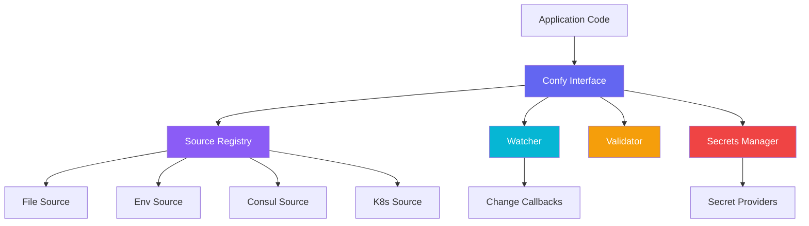

import { Cards, Card } from 'fumadocs-ui/components/card';
import { Callout } from 'fumadocs-ui/components/callout';
import { FileText, Database, Eye, Shield, Key, TestTube, Search, Layers } from "lucide-react";

A configuration library for Go that doesn't get in your way.

```go
cfg := confy.New(
    confy.WithWatchInterval(30 * time.Second),
    confy.WithValidationMode(confy.ValidationModeStrict),
    confy.WithSecretsEnabled(true),
)

source, _ := sources.NewFileSource("config.yaml", sources.FileSourceOptions{
    WatchEnabled: true,
})
cfg.LoadFrom(source)

port := cfg.GetInt("server.port", 8080)
debug := cfg.GetBool("debug", false)
timeout := cfg.GetDuration("timeout", 30*time.Second)
```

## Why Confy?

Most config libraries either do too little or too much. Confy sits in the middle:

- **Multiple sources** — files, environment variables, Consul, Kubernetes ConfigMaps
- **Type-safe getters** with sensible defaults
- **Struct binding** when you want it
- **Hot reload** with file watching and change callbacks
- **Auto-discovery** that finds your config files in monorepos
- **Validation** with rules, schemas, and constraints
- **Secrets management** with provider-based resolution and rotation
- **Testing utilities** for unit tests without external dependencies

No magic globals. No `init()` surprises. Just a struct you control.

## Install

```bash
go get github.com/xraph/confy
```

## Quick Start

### Load from a file

```go
package main

import (
    "github.com/xraph/confy"
    "github.com/xraph/confy/sources"
)

func main() {
    cfg := confy.New()

    source, _ := sources.NewFileSource("config.yaml", sources.FileSourceOptions{
        WatchEnabled: true,
    })
    cfg.LoadFrom(source)

    host := cfg.GetString("database.host", "localhost")
    port := cfg.GetInt("database.port", 5432)
    maxConns := cfg.GetInt("database.max_connections", 10)
}
```

### Auto-discover config files

```go
cfg, err := confy.AutoLoadConfy("myapp", nil)
if err != nil {
    log.Fatal(err)
}

// Automatically finds config.yaml, config.local.yaml
// in current directory and parent directories
port := cfg.GetInt("server.port", 8080)
```

### Bind to a struct

```go
type DatabaseConfig struct {
    Host        string        `yaml:"host"`
    Port        int           `yaml:"port"`
    MaxConns    int           `yaml:"max_connections" default:"10"`
    IdleTimeout time.Duration `yaml:"idle_timeout" default:"5m"`
}

var dbCfg DatabaseConfig
cfg.Bind("database", &dbCfg)
```

## Architecture



## Source Priority

Sources are merged by priority. Higher priority sources override lower ones:

| Priority | Source | Description |
|----------|--------|-------------|
| 50 | Env (low) | Environment variables below files |
| 100 | Base config | `config.yaml` |
| 200 | Local config | `config.local.yaml` (overrides base) |
| 300 | Env (high) | Environment variables above files |

## Constructor Options

Confy uses the functional options pattern for configuration:

```go
cfg := confy.New(
    confy.WithWatchInterval(30 * time.Second),
    confy.WithValidationMode(confy.ValidationModeStrict),
    confy.WithSecretsEnabled(true),
    confy.WithCacheEnabled(true),
    confy.WithReloadOnChange(true),
    confy.WithMetricsEnabled(true),
    confy.WithErrorRetryCount(5),
    confy.WithErrorRetryDelay(2 * time.Second),
    confy.WithLogger(myLogger),
)
```

<Callout type="info">
The legacy `confy.NewFromConfig(confy.Config{...})` pattern is still supported for backward compatibility.
</Callout>

## Documentation

<Cards>
  <Card title="Sources" description="File, env, Consul, and Kubernetes configuration sources" href="/docs/confy/sources" icon={<Database />} />
  <Card title="Type-Safe Getters" description="Typed accessors with defaults and advanced options" href="/docs/confy/type-safe-getters" icon={<Layers />} />
  <Card title="Struct Binding" description="Bind configuration sections to Go structs" href="/docs/confy/struct-binding" icon={<FileText />} />
  <Card title="Variable Resolution" description="Environment expansion, bash defaults, secret references" href="/docs/confy/variable-resolution" icon={<Search />} />
  <Card title="Auto-Discovery" description="Find config files across monorepos automatically" href="/docs/confy/auto-discovery" icon={<Search />} />
  <Card title="Watching" description="Hot reload with file watching and change detection" href="/docs/confy/watching" icon={<Eye />} />
  <Card title="Validation" description="Schema validation with rules, modes, and constraints" href="/docs/confy/validation" icon={<Shield />} />
  <Card title="Secrets" description="Secret management with providers, rotation, and encryption" href="/docs/confy/secrets" icon={<Key />} />
  <Card title="Testing" description="In-memory test implementation and builder utilities" href="/docs/confy/testing" icon={<TestTube />} />
</Cards>
