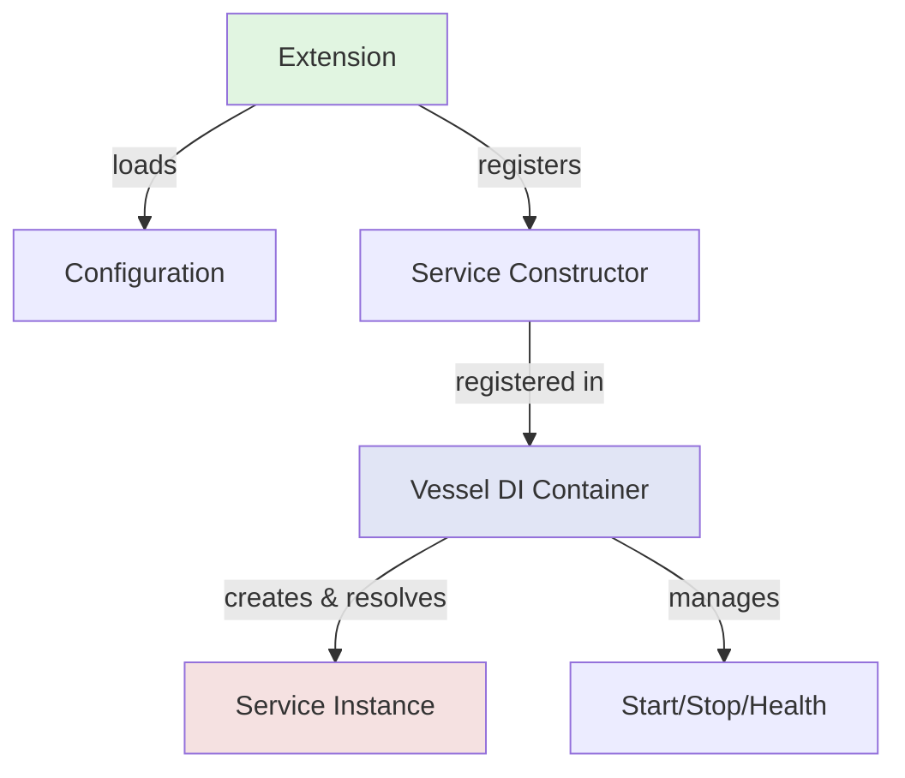

# Constructor Injection Pattern for Extensions

Forge extensions now support **constructor injection** using Vessel's type-based dependency resolution. This pattern separates configuration concerns from service lifecycle management, making extensions cleaner and more maintainable.

## Core Principles

1. **Extensions**: Load configuration and register service constructors
2. **Services**: Implement business logic and `di.Service` interface for lifecycle
3. **Vessel**: Manages service creation, resolution, and lifecycle
4. **Single Responsibility**: Service lifecycle is managed ONLY by Vessel, not by extensions

## Architecture



## Pattern Overview

### Old Pattern (Deprecated)

```go
// BAD: Extension manages service lifecycle
type Extension struct {
    config  Config
    service *MyService  // Extension stores service
}

func (e *Extension) Register(app forge.App) error {
    e.service = NewMyService(e.config)
    // Manual DI registration
    forge.RegisterSingleton(app.Container(), "myService", func(c forge.Container) (*MyService, error) {
        return e.service, nil
    })
    return nil
}

func (e *Extension) Start(ctx context.Context) error {
    // Extension manually starts service
    return e.service.Start(ctx)
}
```

### New Pattern (Recommended)

```go
// GOOD: Extension registers constructor, Vessel manages lifecycle
type Extension struct {
    *forge.BaseExtension
    config Config
    // No service storage!
}

func (e *Extension) Register(app forge.App) error {
    e.BaseExtension.Register(app)
    cfg := e.loadConfig()
    
    // Register constructor - config captured in closure
    return e.RegisterConstructor(func(logger forge.Logger, metrics forge.Metrics) (*MyService, error) {
        return NewMyService(cfg, logger, metrics)
    })
}

func (e *Extension) Start(ctx context.Context) error {
    e.MarkStarted()
    return nil  // Service started by Vessel!
}
```

## Complete Example: Cache Extension

### Step 1: Create Service with Lifecycle

```go
// service.go
package cache

import (
    "context"
    "fmt"
    "github.com/xraph/forge"
)

// CacheService implements di.Service for lifecycle management
type CacheService struct {
    config  Config
    backend CacheBackend
    logger  forge.Logger
    metrics forge.Metrics
}

// Constructor
func NewCacheService(config Config, logger forge.Logger, metrics forge.Metrics) (*CacheService, error) {
    backend := NewInMemoryCache(config, logger, metrics)
    return &CacheService{
        config:  config,
        backend: backend,
        logger:  logger,
        metrics: metrics,
    }, nil
}

// di.Service interface implementation
func (s *CacheService) Name() string { return "cache-service" }

func (s *CacheService) Start(ctx context.Context) error {
    s.logger.Info("starting cache service")
    return s.backend.Connect(ctx)
}

func (s *CacheService) Stop(ctx context.Context) error {
    s.logger.Info("stopping cache service")
    return s.backend.Disconnect(ctx)
}

func (s *CacheService) Health(ctx context.Context) error {
    return s.backend.Ping(ctx)
}
```

### Step 2: Create Lightweight Extension

```go
// extension.go
package cache

import (
    "context"
    "github.com/xraph/forge"
)

type Extension struct {
    *forge.BaseExtension
    config Config
}

func NewExtension(opts ...ConfigOption) forge.Extension {
    config := DefaultConfig()
    for _, opt := range opts {
        opt(&config)
    }
    
    base := forge.NewBaseExtension("cache", "2.0.0", "Caching extension")
    
    return &Extension{
        BaseExtension: base,
        config:        config,
    }
}

func (e *Extension) Register(app forge.App) error {
    e.BaseExtension.Register(app)
    
    // Load config
    cfg := e.loadConfig()
    
    // Register service constructor - config captured in closure
    if err := e.RegisterConstructor(func(logger forge.Logger, metrics forge.Metrics) (*CacheService, error) {
        return NewCacheService(cfg, logger, metrics)
    }); err != nil {
        return fmt.Errorf("failed to register cache service: %w", err)
    }
    
    // Register by name for backward compatibility
    if err := forge.RegisterSingleton(app.Container(), "cache", func(c forge.Container) (Cache, error) {
        return forge.InjectType[*CacheService](c)
    }); err != nil {
        return err
    }
    
    e.Logger().Info("cache extension registered")
    return nil
}

// Lightweight lifecycle - just bookkeeping
func (e *Extension) Start(ctx context.Context) error {
    e.MarkStarted()
    return nil
}

func (e *Extension) Stop(ctx context.Context) error {
    e.MarkStopped()
    return nil
}

func (e *Extension) Health(ctx context.Context) error {
    return nil  // Service health managed by Vessel
}
```

## Type-Based Resolution

Services can be resolved by type without string keys:

```go
// In your app or other extensions
func (e *MyExtension) Register(app forge.App) error {
    return e.RegisterConstructor(func(cache *cache.CacheService) (*MyService, error) {
        // cache automatically resolved by type!
        return NewMyService(cache), nil
    })
}

// Or resolve manually
cacheService, err := forge.InjectType[*cache.CacheService](container)
```

## Multiple Services Pattern

For extensions managing multiple services:

```go
func (e *Extension) Register(app forge.App) error {
    e.BaseExtension.Register(app)
    cfg := e.loadConfig()
    
    // Register all services
    return e.RegisterConstructors(
        func(logger forge.Logger, metrics forge.Metrics) (*ManagerService, error) {
            return NewManagerService(cfg, logger, metrics), nil
        },
        func(logger forge.Logger) (*WorkerService, error) {
            return NewWorkerService(cfg, logger), nil
        },
        func(mgr *ManagerService, worker *WorkerService) (*CoordinatorService, error) {
            // Dependencies auto-resolved by type!
            return NewCoordinatorService(mgr, worker), nil
        },
    )
}
```

## Named Services

When you need multiple instances of the same type:

```go
// Register with names
vessel.ProvideConstructor(c, func() *Database {
    return NewPrimaryDB(cfg.Primary)
}, vessel.WithName("primary"))

vessel.ProvideConstructor(c, func() *Database {
    return NewReplicaDB(cfg.Replica)
}, vessel.WithName("replica"))

// Resolve by name
primary, _ := forge.InjectNamed[*Database](c, "primary")
replica, _ := forge.InjectNamed[*Database](c, "replica")
```

## Configuration Patterns

### Pattern 1: Config Closure (Simplest)

```go
func (e *Extension) Register(app forge.App) error {
    e.BaseExtension.Register(app)
    cfg := e.loadConfig()  // Load once
    
    // Config captured in closure
    return e.RegisterConstructor(func(logger forge.Logger, metrics forge.Metrics) (*Service, error) {
        return NewService(cfg, logger, metrics), nil
    })
}
```

### Pattern 2: Config as Service

```go
func (e *Extension) Register(app forge.App) error {
    e.BaseExtension.Register(app)
    cfg := e.loadConfig()
    
    // Register config as service
    forge.RegisterValue(app.Container(), "myext:config", cfg)
    
    // Service depends on config
    return e.RegisterConstructor(func(config Config, logger forge.Logger) (*Service, error) {
        return NewService(config, logger), nil
    })
}
```

## Benefits

1. **Clean Separation**: Extensions configure, Services execute, DI connects
2. **Type Safety**: Compile-time type checking for dependencies
3. **Testability**: Services with constructors are trivial to test
4. **Single Source of Truth**: Vessel manages ALL service lifecycle
5. **Less Boilerplate**: No manual Start/Stop in extensions
6. **Better DX**: IDE autocomplete and refactoring support

## Migration Guide

See [Extension Migration Guide](/docs/guides/extension-migration) for step-by-step migration instructions.

## Examples

- **Simple**: [Cache Extension](https://github.com/xraph/forge/tree/main/extensions/cache)
- **Complex**: [Database Extension](https://github.com/xraph/forge/tree/main/extensions/database) (multiple services)
- **Advanced**: [AI Extension](https://github.com/xraph/forge/tree/main/extensions/ai) (optional dependencies)
- **Event-Driven**: [Events Extension](https://github.com/xraph/forge/tree/main/extensions/events)
- **Queue System**: [Queue Extension](https://github.com/xraph/forge/tree/main/extensions/queue)

## Best Practices

1. ✅ Use `BaseExtension` for common functionality
2. ✅ Register services via constructors
3. ✅ Implement `di.Service` for services needing lifecycle
4. ✅ Capture config in constructor closures
5. ✅ Keep Extension.Start/Stop lightweight
6. ✅ Let Vessel manage service lifecycle
7. ✅ Use type-based resolution when possible
8. ❌ Don't store service instances in extensions
9. ❌ Don't manage service lifecycle in extensions
10. ❌ Don't call service Start/Stop manually
