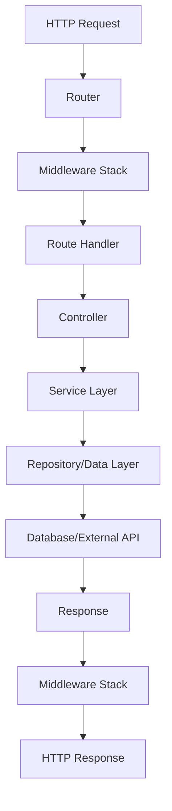

import { Callout } from 'fumadocs-ui/components/callout'
import { Tab, Tabs } from 'fumadocs-ui/components/tabs'

# Architecture

Forge follows a clean, layered architecture that promotes separation of concerns, testability, and maintainability. This document explains the core architectural principles and how components interact.

## Design Principles

Forge is built on several key principles:

- **Clean Architecture**: Clear separation between business logic, infrastructure, and presentation layers
- **Dependency Injection**: Loose coupling through dependency injection and interface-based design
- **Extensibility**: Plugin-based architecture for adding functionality
- **Observability**: Built-in metrics, logging, and health checks
- **Performance**: Optimized for high concurrency and low latency
- **Developer Experience**: Intuitive APIs and comprehensive tooling

## Core Components

<Tabs items={['Application Layer', 'Infrastructure Layer', 'Extension Layer']}>
  <Tab value="Application Layer">
    ### Application Layer

    The application layer contains your business logic and orchestrates the flow of data:

    **App Interface**
    ```go
    type App interface {
        Container() Container
        Router() Router
        Config() ConfigManager
        Logger() Logger
        Metrics() Metrics
        HealthManager() HealthManager
        
        Start(ctx context.Context) error
        Stop(ctx context.Context) error
        Run() error
        
        RegisterService(name string, factory Factory, opts ...RegisterOption) error
        RegisterController(controller Controller) error
        RegisterExtension(ext Extension) error
    }
    ```

    **Key Responsibilities:**
    - Application lifecycle management
    - Service registration and orchestration
    - Extension management
    - Configuration management
    - Error handling and recovery

    **Controllers**
    ```go
    type Controller interface {
        RegisterRoutes(router Router) error
        Name() string
    }
    ```

    Controllers encapsulate related HTTP handlers and business logic.
  </Tab>

  <Tab value="Infrastructure Layer">
    ### Infrastructure Layer

    The infrastructure layer provides the technical foundation:

    **Router**
    ```go
    type Router interface {
        GET(path string, handler HandlerFunc, opts ...RouteOption) error
        POST(path string, handler HandlerFunc, opts ...RouteOption) error
        PUT(path string, handler HandlerFunc, opts ...RouteOption) error
        DELETE(path string, handler HandlerFunc, opts ...RouteOption) error
        Group(path string, opts ...GroupOption) Router
        Use(middleware ...Middleware) error
    }
    ```

    **Container (DI)**
    ```go
    type Container interface {
        Register(name string, factory Factory, opts ...RegisterOption) error
        Get(name string) (interface{}, error)
        Must[T any](name string) T
        Scope() Scope
    }
    ```

    **ConfigManager**
    ```go
    type ConfigManager interface {
        GetString(key string, defaultValue ...string) string
        GetInt(key string, defaultValue ...int) int
        GetBool(key string, defaultValue ...bool) bool
        AddSource(source ConfigSource) error
    }
    ```

    **Logger**
    ```go
    type Logger interface {
        Debug(msg string, fields ...Field)
        Info(msg string, fields ...Field)
        Warn(msg string, fields ...Field)
        Error(msg string, fields ...Field)
        Fatal(msg string, fields ...Field)
    }
    ```
  </Tab>

  <Tab value="Extension Layer">
    ### Extension Layer

    Extensions provide additional functionality:

    **Extension Interface**
    ```go
    type Extension interface {
        Name() string
        Version() string
        Description() string
        Register(app App) error
        Start(ctx context.Context) error
        Stop(ctx context.Context) error
        Health(ctx context.Context) error
        Dependencies() []string
    }
    ```

    **Available Extensions:**
    - **AI**: LLM integration, agents, inference
    - **Auth**: Authentication and authorization
    - **Cache**: Redis, Memcached, in-memory caching
    - **Database**: SQL and NoSQL database support
    - **Events**: Event-driven architecture
    - **GraphQL**: GraphQL server
    - **gRPC**: gRPC services
    - **Kafka**: Apache Kafka integration
    - **MQTT**: MQTT broker
    - **Storage**: File storage backends
    - **WebRTC**: Real-time communication

    **Extension Lifecycle:**
    1. **Register**: Register services with DI container
    2. **Start**: Initialize and start the extension
    3. **Health**: Periodic health checks
    4. **Stop**: Graceful shutdown
  </Tab>
</Tabs>

## Request Flow

Here's how a typical HTTP request flows through Forge:



### Detailed Flow

1. **HTTP Request**: Request arrives at the server
2. **Router**: Matches request to registered route
3. **Middleware Stack**: Executes middleware in order
4. **Route Handler**: Executes the registered handler function
5. **Controller**: Business logic and orchestration
6. **Service Layer**: Core business logic
7. **Repository**: Data access layer
8. **Database**: Data persistence
9. **Response**: Data flows back through the layers
10. **HTTP Response**: Final response sent to client

## Dependency Injection

Forge uses a powerful dependency injection system:

### Service Lifetimes

**Singleton**: Single instance per container
```go
app.RegisterService("config", func(container Container) (interface{}, error) {
    return configManager, nil
}, forge.WithSingleton())
```

**Scoped**: Instance per scope (e.g., HTTP request)
```go
app.RegisterService("userContext", func(container Container) (interface{}, error) {
    return &UserContext{}, nil
}, forge.WithScoped())
```

**Transient**: New instance every time
```go
app.RegisterService("validator", func(container Container) (interface{}, error) {
    return &Validator{}, nil
}, forge.WithTransient())
```

### Service Resolution

```go
// Get service by name
service, err := app.Container().Get("userService")
if err != nil {
    return err
}

// Type-safe resolution
userService := forge.Must[UserService](app.Container(), "userService")

// Scoped resolution
scopedContainer := app.Container().Scope()
userContext := forge.Must[UserContext](scopedContainer, "userContext")
```

## Configuration Management

Forge provides flexible configuration management:

### Configuration Sources

```go
config := forge.NewConfigManager()

// File sources
config.AddSource(forge.NewFileSource("config.yaml"))
config.AddSource(forge.NewFileSource("config.json"))

// Environment variables
config.AddSource(forge.NewEnvSource())

// Command line arguments
config.AddSource(forge.NewFlagSource())

// Default values
config.SetDefault("server.port", 8080)
config.SetDefault("database.host", "localhost")
```

### Configuration Access

```go
// String values
port := config.GetString("server.port", "8080")
host := config.GetString("database.host", "localhost")

// Numeric values
timeout := config.GetInt("server.timeout", 30)
maxConnections := config.GetInt("database.max_connections", 100)

// Boolean values
debug := config.GetBool("debug", false)
enableMetrics := config.GetBool("metrics.enabled", true)

// Complex types
var dbConfig DatabaseConfig
config.Unmarshal("database", &dbConfig)
```

## Error Handling

Forge provides comprehensive error handling:

### HTTP Errors

```go
// Predefined HTTP errors
return forge.BadRequest("invalid request")
return forge.Unauthorized("authentication required")
return forge.Forbidden("access denied")
return forge.NotFound("resource not found")
return forge.InternalError("internal server error")

// Custom HTTP errors
return forge.NewHTTPError(422, "validation failed", map[string]string{
    "field": "email",
    "error": "invalid format",
})
```

### Error Middleware

```go
app.Router().Use(forge.ErrorMiddleware(func(err error, ctx forge.Context) {
    app.Logger().Error("request failed",
        forge.F("error", err),
        forge.F("path", ctx.Path()),
        forge.F("method", ctx.Method()),
    )
}))
```

## Observability

Forge includes built-in observability features:

### Metrics

```go
// Counter metrics
app.Metrics().Counter("requests_total").Inc()

// Gauge metrics
app.Metrics().Gauge("active_connections").Set(42)

// Histogram metrics
app.Metrics().Histogram("request_duration").Observe(0.5)
```

### Logging

```go
// Structured logging
app.Logger().Info("user created",
    forge.F("user_id", userID),
    forge.F("email", email),
    forge.F("duration", time.Since(start)),
)

// Error logging
app.Logger().Error("database error",
    forge.F("error", err),
    forge.F("query", query),
    forge.F("duration", time.Since(start)),
)
```

### Health Checks

```go
// Register health checks
app.HealthManager().Register("database", func(ctx context.Context) forge.HealthResult {
    if err := db.Ping(ctx); err != nil {
        return forge.HealthResult{
            Status: forge.HealthStatusUnhealthy,
            Message: "database connection failed",
        }
    }
    return forge.HealthResult{
        Status: forge.HealthStatusHealthy,
        Message: "database is healthy",
    }
})
```

## Testing Architecture

Forge provides comprehensive testing support:

### Test Utilities

```go
func TestUserHandler(t *testing.T) {
    // Create test app
    app := forge.NewTestApp(forge.TestAppConfig{
        Name: "test-app",
    })
    
    // Register test services
    app.RegisterService("userService", func(container forge.Container) (interface{}, error) {
        return &MockUserService{}, nil
    })
    
    // Test HTTP endpoints
    resp := app.Test().GET("/users/123").Expect(t)
    resp.Status(200)
    resp.JSON().Object().Value("id").Equal("123")
}
```

### Mock Services

```go
type MockUserService struct{}

func (m *MockUserService) GetUser(id string) (*User, error) {
    return &User{ID: id, Name: "Test User"}, nil
}
```

## Performance Considerations

### Connection Pooling

```go
// Database connection pooling
dbConfig := forge.DatabaseConfig{
    MaxOpenConns: 100,
    MaxIdleConns: 10,
    ConnMaxLifetime: time.Hour,
}
```

### Caching

```go
// Register cache service
app.RegisterExtension(cache.NewExtension(cache.WithDriver("redis")))
```

### Middleware Optimization

```go
// Efficient middleware ordering
app.Router().Use(
    forge.RecoveryMiddleware(),    // First: catch panics
    forge.LoggingMiddleware(),     // Second: log requests
    forge.AuthMiddleware(),        // Third: authentication
    forge.RateLimitMiddleware(),   // Fourth: rate limiting
)
```

## Security Architecture

### Authentication

```go
// JWT authentication
app.RegisterExtension(auth.NewExtension(auth.WithJWTProvider(jwtConfig)))

// API key authentication
app.RegisterExtension(auth.NewExtension(auth.WithAPIKeyProvider(apiKeyConfig)))
```

### Authorization

```go
// Role-based access control
app.Router().GET("/admin/users", handler, forge.WithRequiredAuth("jwt", "admin"))
```

### Input Validation

```go
// Request validation
type CreateUserRequest struct {
    Name  string `json:"name" validate:"required,min=2,max=50"`
    Email string `json:"email" validate:"required,email"`
}

app.Router().POST("/users", handler, forge.WithValidation(true))
```

## Best Practices

1. **Separation of Concerns**: Keep business logic separate from infrastructure
2. **Interface-Based Design**: Use interfaces for better testability
3. **Error Handling**: Always handle errors explicitly
4. **Configuration**: Use configuration management for environment-specific settings
5. **Logging**: Use structured logging with contextual information
6. **Testing**: Write comprehensive tests for all components
7. **Performance**: Profile and optimize critical paths
8. **Security**: Implement proper authentication and authorization

<Callout type="info">
For more detailed information about specific components, see the individual concept documentation pages.
</Callout>
