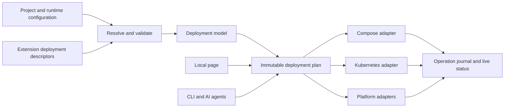

# Forge deployment workbench

Status: source review and proposal, 9 October 2026. The browser mock and documentation are implemented. The deployment compiler, new CLI commands and provider adapters described here are not implemented.

The design decisions, the final `deploy:` schema and the implementation order now live in the design spec at `docs/superpowers/specs/2026-10-09-forge-deploy-design.md`, with shared contracts and the first three plans under `docs/superpowers/plans/`. That directory is gitignored in this repository, so those files sit beside the code in a checkout and are not on GitHub. Where this review and the spec differ, the spec wins. Three things changed on the way from this document to the spec: the `deploy:` block is inline in `.forge.yml` by default with `deploy/stack.yml` as an optional split; bindings reach the app through an overlay file named by a new `FORGE_CONFIG_OVERLAY` variable; and extension descriptors ship in the CLI first, with module-shipped `forge-deploy.yaml` files and a runtime interface following later. The findings table below is still the record of what the current code does.

You should be able to run `forge deploy start`, pick a target, resolve the few decisions Forge cannot infer, and deploy the application with its data services. Your choices belong in files. The local page, terminal and AI agent must use the same planner and executor.

Open the [interactive mock](../public/mock/deploy.html) or visit `/mock/deploy.html` in the docs app. It uses a sample three-service project. You can configure targets, review connections, download proposal files and rehearse a deployment. It does not read your repository or contact a provider.

## What the current code does

This review follows the source in the primary checkout, not the advertised command descriptions. No live provider deployment was performed.

| Finding                                                                                                                                   | Source                                                                                                                                 | Consequence and first fix                                                                                                                                                          |
| ----------------------------------------------------------------------------------------------------------------------------------------- | -------------------------------------------------------------------------------------------------------------------------------------- | ---------------------------------------------------------------------------------------------------------------------------------------------------------------------------------- |
| `forge deploy` simulates image build, push and Kubernetes deployment; `deploy status` returns fixed rows                                  | `cmd/forge/plugins/deploy.go`, `buildDockerImage`, `pushDockerImage`, `deployToKubernetes`, `deployStatus`                             | P0: a successful exit does not establish deployment. Return an unsupported-operation error until these commands delegate to the real executor.                                     |
| `forge cloud` simulates authentication, deployment progress, rollback and scaling                                                         | `cmd/forge/plugins/cloud.go`                                                                                                           | P0: expose availability honestly. Never emit successful remote operations from fixtures.                                                                                           |
| DigitalOcean and Render deploy handlers print success without submitting a deployment                                                     | `cmd/forge/plugins/infra.go`, `deployWithExportedDO`, `deployWithGeneratedDO`, `deployWithExportedRender`, `deployWithGeneratedRender` | P0: retain export, label handoff explicitly and disable simulated apply.                                                                                                           |
| Compose and Kubernetes infra paths run external tools, but do not verify application rollout                                              | `cmd/forge/plugins/infra.go`, `executeDockerComposeUp`, `executeKubectlApplyKustomize`                                                 | Separate resources accepted from application healthy. Add timeouts, cancellation and readiness observation.                                                                        |
| Kubernetes service filtering is not enforced in the apply helper; an obsolete client-version flag decides whether to use Kustomize        | `cmd/forge/plugins/infra.go`, `executeKubectlApplyKustomize`, `checkKustomizeAvailable`                                                | Plan an exact resource set. Validate with `kubectl kustomize`, fail on render errors, and never fall back to applying an overlay directory as raw YAML.                            |
| Database/cache detection is a project-wide flag or an import substring in `main.go`                                                       | `cmd/forge/plugins/infra/introspect.go`, `introspectApp`                                                                               | This misses Grove, Trove, helper packages and named connections, and can assign dependencies to the wrong app. Return suggestions with provenance, then require explicit bindings. |
| Exported containers hard-code port 8080, old Go builder images and `latest`; Kubernetes probes use `/health` and `/ready`                 | `cmd/forge/plugins/infra/generator.go`                                                                                                 | Compile the declared runtime contract, toolchain and image digest. Probe paths must be verified against the app, including custom Forge system routes.                             |
| Detected database and cache needs only produce environment examples, not the backing resources                                            | `cmd/forge/plugins/infra/generator.go`, `generateEnvExample`, `generateK8sDeployment`                                                  | Model resources and extension bindings together. Missing infrastructure must block planning.                                                                                       |
| `.forge.yaml` and `.forge.yml` work, but malformed local files can be ignored while searching parents; saves re-marshal the entire struct | `cmd/forge/config/loader.go`, `LoadForgeConfig`, `SaveForgeConfig`; `app_config.go`                                                    | Stop on errors other than missing files. Preserve spelling, comments, unknown extension keys and concurrent edits.                                                                 |
| Deployment configuration has provider options and environments, but no service graph, resource lifecycle or capability model              | `cmd/forge/config/types.go`, `DeployConfig`, `AppConfig`                                                                               | Introduce a versioned deployment section and migrate legacy input explicitly.                                                                                                      |
| Kubernetes discovery already uses a namespace-scoped Service informer                                                                     | `extensions/discovery/backends/kubernetes.go`                                                                                          | Reuse it when an app needs dynamic discovery. Ordinary calls can use Service DNS without Kubernetes API privileges.                                                                |
| Grove supports named databases; Trove supports named stores and a Grove database for metadata                                             | Sibling sources: `forgery/grove/extension/config.go`, `forgery/trove/extension/config.go`                                              | Preserve connection/store names and metadata bindings. Do not create a fictitious Grove or Trove server container.                                                                 |

The legacy generator is useful scaffolding. It is not sufficient to claim production deployment. These P0 fixes are the first implementation slice, before adding another deployment entry point.

## Proposed first experience

```sh
# Proposed commands. These do not exist yet.
forge deploy start
forge deploy inspect --output json
forge deploy doctor --target kubernetes --env production --output json
forge deploy plan --target kubernetes --env production --out .forge/plans/production.json
forge deploy export --plan .forge/plans/production.json --output deployments/production
forge deploy apply --plan .forge/plans/production.json --approve-plan <sha256> --non-interactive
forge deploy status --env production --output json
forge deploy logs --env production --service api --follow
forge deploy rollback --env production --release <release-id>
```

The first run discovers buildable apps and reads configuration without importing or executing application code. You confirm app kinds, actual ports and missing dependencies once. The page keeps the service list visible, shows unresolved choices above it and provides a file diff beside the plan. Later deployments can be one click after credentials, target and configuration are saved and validated.

For AI, the same process is non-interactive: inspect, resolve explicit diagnostics, plan, export and apply the approved plan. No browser is required. JSON Schema, stable JSON output and precise errors let an agent edit files without guessing CLI prompts.

## One compiler, several adapters



Use typed Go structures for `Application`, `Service`, `Port`, `Connection`, `Resource`, `Binding`, `SecretRef`, `TargetCapabilities`, `Artifact` and `Operation`. Providers translate this model. They must not independently rediscover applications or reinterpret runtime YAML.

Keep this in the CLI module initially, under `cmd/forge/internal/deploy/`. It does not belong in every application's runtime dependencies. Suggested packages: `spec`, `resolve`, `catalog`, `plan`, `render`, `providers`, `state` and `workbench`. Existing infra exporters become compatibility wrappers once their output passes the new checks.

An adapter needs `Capabilities`, `Validate`, `Render`, `Plan`, `Apply`, `Observe`, `Logs` and `Rollback`. A declarative export adapter may omit remote operations, but must return `unsupported`, never success. Version provider schemas and extension descriptors; extensions can publish descriptors without adding their runtime dependencies to the CLI.

## Configuration and file ownership

Keep the existing project, build and database sections. Add `deploy.version: 2`, a `deploy.spec` path, environment files and named targets. Preserve the existing environments list during migration. The examples below are a proposed schema, not input supported by the current CLI.

```yaml
# .forge.yml, proposed additions
project:
  name: atlas
  module: example.com/atlas
  layout: single-module
build:
  apps:
    - name: gateway
      cmd: ./cmd/gateway
    - name: api
      cmd: ./cmd/api
    - name: worker
      cmd: ./cmd/worker
deploy:
  version: 2
  registry: ghcr.io/example
  spec: ./deploy/stack.yml
  defaults:
    target: kubernetes
    environment: production
  environment_files:
    production: ./deploy/environments/production.yml
  targets:
    kubernetes:
      provider: kubernetes
      context: production-cluster
      namespace: atlas-production
```

```yaml
# deploy/stack.yml, abbreviated proposed service/resource contract
version: 1
services:
  api:
    build_app: api
    kind: web
    config_files: [./config/api.yaml]
    ports:
      http: { port: 8080, protocol: http, exposure: private }
    health:
      readiness: { port: http, path: /_/health/ready }
      liveness: { port: http, path: /_/health/live }
    bindings:
      - { resource: primary, extension: grove, connection: primary }
      - {
          resource: objects,
          extension: trove,
          store: uploads,
          metadata_database: primary,
        }
      - { resource: cache, extension: cache }
resources:
  primary:
    type: postgres
    lifecycle: external
    connection: { secret_ref: primary-dsn }
  objects:
    type: object-storage
    lifecycle: external
    connection: { secret_ref: objects-dsn }
    bucket: atlas-uploads
  cache:
    type: redis
    lifecycle: external
    connection: { secret_ref: cache-url }
    capabilities: [json, search]
connections:
  - from: gateway
    to: api
    port: http
    binding: { config_key: services.api.url }
    timeout: 5s
    retry: { attempts: 0 }
```

The complete mock export includes gateway and worker definitions, per-service config files, environment overrides and secret references. Do not paste this abbreviated service contract into a live deployment.

Use three resource lifecycle modes: `external` binds an existing resource, `managed` provisions through a provider, and `self-hosted` renders an explicitly selected container or operator recipe. A local development preset chooses Compose containers. Production defaults to managed or external data services; self-hosted production needs a backup, restore and availability policy.

| File                             | Owner and contents                                                                                                                                                                |
| -------------------------------- | --------------------------------------------------------------------------------------------------------------------------------------------------------------------------------- |
| `.forge.yml` or `.forge.yaml`    | Project metadata, existing build config and deployment entry points. Preserve the filename already in use.                                                                        |
| `deploy/stack.yml`               | Service contracts, directed connections, resource intent and typed bindings. Editable and committed.                                                                              |
| `deploy/environments/<env>.yml`  | Environment-specific replicas, target and resource overrides. No secret values.                                                                                                   |
| `config/<service>.yaml`          | Existing application configuration. The compiler mounts non-secret settings and binds secret fields without changing application configuration precedence.                        |
| `deploy/secrets.example.yml`     | Logical secret names and resolver locations. References only.                                                                                                                     |
| `deploy/lock.yml`                | Committed descriptor versions, image/chart digests, provider schema versions and chosen recipe IDs. No credentials, local paths or mutable remote status.                         |
| `deployments/<target>/<env>/`    | Reproducible generated artifacts and an ownership manifest of file hashes. User patches live in separate overlays.                                                                |
| `.forge/plans/`, `.forge/state/` | Gitignored plans and deployment journal with restrictive permissions and redacted provider output. Remote resource IDs are namespaced by target account, project and environment. |

Resolution order: catalog defaults, project declaration, app declaration, environment override, explicit CLI override. Merge maps by key and named records by identity. Require an explicit remove operation; do not concatenate service lists or silently replace all resources. Runtime file/environment/Go-option precedence remains the application's existing contract.

Detect unknown keys, duplicate names, missing ports, unresolved resources and cyclic startup dependencies. Point diagnostics to file, line and field. Stop on invalid local YAML before looking for another project in a parent directory. Reject simultaneous ambiguous `.forge.yml` and `.forge.yaml` files. Never run an app to discover deployment metadata without an explicit trusted execution mode.

The current YAML loader silently accepts unknown deployment fields. Therefore version rejection must ship before v2 configuration is offered as deployable: old command paths must reject v2 intent, and migration must write a backup and a reviewable diff. Use a YAML node editor so comments, anchors and extension keys survive. Apply writes under a project lock with an expected file hash, same-directory temp file, fsync and atomic rename; retain a recovery journal for multi-file writes.

## Grove, Trove and the dependency catalog

Library detection can suggest a requirement. It cannot tell you which database, bucket or Redis feature your application needs. A deployment descriptor declares supported versions, configuration schema, resource requirements, bindings, ports, health checks, migrations and operational policies. Explicit configuration is authoritative; low-confidence inference is shown as a question with its source.

| Requirement                                     | Local preset                                                                | Kubernetes                                                  | Managed/platform target                               | Acceptance condition                                                                              |
| ----------------------------------------------- | --------------------------------------------------------------------------- | ----------------------------------------------------------- | ----------------------------------------------------- | ------------------------------------------------------------------------------------------------- |
| Grove PostgreSQL                                | Pinned PostgreSQL container, volume, health check                           | Existing DSN or a separately selected operator recipe       | Managed PostgreSQL or external DSN                    | Named database, TLS, driver import, migration ownership and readiness work.                       |
| Grove MySQL, MongoDB, ClickHouse, Elasticsearch | Only selected, versioned recipes                                            | Existing endpoint or qualified operator                     | Provider capability or external connection            | Validate dialect and required database features. No substitution with PostgreSQL.                 |
| Grove SQLite, Turso                             | File volume or remote Turso DSN                                             | Explicit file ownership/PVC or remote DSN                   | Persistent disk if compatible, otherwise remote DSN   | Block multi-writer replicas against a local SQLite file unless its access contract supports them. |
| Grove KV / cache                                | Selected Redis, Valkey, Memcached or embedded backend                       | Existing endpoint or qualified recipe                       | Compatible managed endpoint                           | Preserve namespaces, serialization and ACLs; embedded memory is process-local.                    |
| Trove S3                                        | Selected S3-compatible service, persistent volume and bucket initialization | Existing object service or selected operator                | External S3-compatible service and scoped credentials | Correct DSN grammar, bucket, endpoint, region, permissions and metadata database.                 |
| Trove GCS, Azure, SFTP, filesystem              | Selected backend; local files only when intentional                         | Workload identity, external connection or explicit volume   | Target-compatible identity and endpoint               | A filesystem store cannot silently become object storage; block unsafe replica/disk combinations. |
| Redis Stack / Redis feature set                 | Pinned recipe that provides required features                               | Selected compatible image/operator or external endpoint     | Managed Redis only after capability verification      | Probe required JSON/search/time-series commands. A Redis-compatible protocol is insufficient.     |
| Queue / events / streaming                      | Selected NATS, Kafka, Redis or other declared backend                       | Compatible recipe or managed endpoint                       | Compatible external service                           | Validate delivery, persistence, consumer identity and replay requirements.                        |
| Dynamic discovery / FARP                        | Static Compose DNS by default; mDNS for an explicit LAN profile             | Service DNS, optional existing Kubernetes discovery backend | Provider private networking or configured registry    | Schema routes require explicit exposure/auth policy. Discovery never grants authorization.        |

Grove and Trove run inside the app. Provision their backends and generate actual extension settings. Grove bindings map to `databases[].name`, `driver` and `dsn`; Trove bindings map to `stores[].name`, `storage_driver`, `grove_database` and `default_bucket`. Validate against the pinned extension version, including Trove's shared dashboard content secret when replicas share ticket verification.

Do not assume `${...}` strings in runtime YAML are resolved by Forge. The compiler must materialize typed resource bindings as mounted runtime settings or verified environment overrides and explain how each value reaches the app. Redacted previews show secret references only. A single shared migration job should use the application's migration entry point and Grove lock behavior; avoid running the same schema change independently in every replica. Trove metadata must be included in the migration graph. Secrets generated once for a resource belong in its secret provider and remain stable across apply retries.

Redis Stack compatibility is a feature/version contract. Redis documents upgrades from Stack 7.2/7.4 to Redis 8, so keep recipes versioned and verify the features requested by the app instead of choosing a floating Stack image. [Redis upgrade guide](https://redis.io/docs/latest/operate/oss_and_stack/install/upgrade/).

## Service communication

Declare directed service edges with a named port, protocol, destination scope and runtime binding. Gateway to API is an HTTP edge. Worker to Redis is a resource binding. A background worker with no listener does not get a public route or an invented health HTTP port.

The resolver emits stable service addresses: Compose service names, Kubernetes Service DNS or provider connection properties. It rewrites environment-specific names consistently and renders only declared ingress. For cross-cluster/platform calls, require an explicit reachable endpoint, TLS/authentication, allowed egress and region constraints. Do not imply a private LAN exists between arbitrary providers.

Use the existing discovery extension when runtime discovery is requested. On Kubernetes its Service informer needs namespace-scoped `get/list/watch` permissions; ordinary DNS-based callers do not. Reuse FARP for contract advertisement where needed, but review gateway integration and schema authentication before enabling automatic routes.

Render connection policies from the graph. On Kubernetes default-deny ingress/egress needs explicit DNS, service/resource ports, health/telemetry and approved external egress. The cluster CNI must enforce NetworkPolicy; rendering a policy alone proves nothing. [Kubernetes DNS](https://kubernetes.io/docs/concepts/services-networking/dns-pod-service/) and [NetworkPolicy](https://kubernetes.io/docs/concepts/services-networking/network-policies/) document these mechanisms.

Service identity and end-user identity are separate. Pass the intended tenant/workspace context through existing auth middleware, validate audience and grants at the receiving service, propagate trace context and never forward a public token to an arbitrary destination. Managed TLS at a public edge does not establish internal mTLS. Offer workload identity/mTLS only through an explicitly configured, capability-checked implementation.

Timeouts are explicit. Default retries to zero for non-idempotent calls; enable bounded retries for known idempotent operations and propagate a stable idempotency key. Rendering a timeout field does not implement caller resilience. Either bind it to a real generated client/gateway transport or report that application code owns it. Test dependency outages, auth denial and trace propagation as part of deployment acceptance.

## Kubernetes output that you can operate

Render deterministic Kustomize bases and overlays with stable names and `app.kubernetes.io/*` labels. Keep service selectors stable across version changes. Preserve user patches outside generated files, validate all YAML with schemas, run `kubectl kustomize` and use server-side dry-run/diff against the selected context before apply.

| Concern       | Required output or diagnostic                                                                                                                                                                             |
| ------------- | --------------------------------------------------------------------------------------------------------------------------------------------------------------------------------------------------------- |
| App kind      | Deployment for web/worker, Job for one-shot work, CronJob for a schedule; only listener services receive a Service.                                                                                       |
| Build         | Correct Go toolchain from the module, workspace-aware context, explicit CGO/native libraries, user Dockerfile override, non-root runtime and immutable image digest.                                      |
| Configuration | Per-service ConfigMap/mounts, secret references, reload/restart checksum and documented environment prefix. Secret values never enter ConfigMaps or committed YAML.                                       |
| Probes        | Verified startup/readiness/liveness contract. Readiness may depend on critical backends; liveness must avoid restarts during a backend outage. TCP/exec/application heartbeats for non-HTTP workers.      |
| Resources     | Requests, limits, deployment deadline, graceful termination, rollout strategy and availability constraints. HPA requires a metrics source; PDB/topology rules must remain feasible for the replica count. |
| Networking    | ClusterIP Services with declared ports, one explicit public gateway, optional Gateway API/Ingress, TLS reference and graph-derived policies. Check CRDs/controller installation first.                    |
| Identity      | Minimal ServiceAccount/RBAC. Disable token automount unless required. Use provider workload identity when configured.                                                                                     |
| Data          | Managed/external binding or selected operator resources; declared storage class, capacity, retention, backup destination/schedule and restore procedure for self-hosted data.                             |
| Migration     | Named, observable pre-rollout Job with lock, timeout and failure blocking. Expand/contract changes preserve compatibility across a rolling update.                                                        |
| Operations    | Rollout observation, resource events/logs, non-secret release metadata and an optional telemetry endpoint binding. Metrics exporter configuration must match an installed collector.                      |

Kubernetes distinguishes startup, readiness and liveness checks. The planner should require a probe contract and test its paths before rollout; it must not guess that every app serves `/ready`. [Kubernetes probe documentation](https://kubernetes.io/docs/concepts/workloads/pods/probes/).

Applying manifests does not install a CNI, ingress controller, certificate controller, external-secrets operator, database operator or metrics server. Detect those prerequisites, show who will install them and the required privileges, and block unresolved production requirements. A simple single-node database StatefulSet can be a development recipe, but is not an HA production database.

## Target support and rollout order

This is the proposed delivery order. None of these adapters has been qualified by this planning task.

| Target                                          | First supported path                                                          | Constraints that stay visible                                                                                              |
| ----------------------------------------------- | ----------------------------------------------------------------------------- | -------------------------------------------------------------------------------------------------------------------------- |
| Docker Compose                                  | Local stack and explicit single-host deployment                               | Host architecture, ports, volumes, secrets and backup responsibility; no implied multi-host availability.                  |
| Kubernetes                                      | OCI images, Kustomize, external/managed data, then qualified operator recipes | Context/account, RBAC, controllers, storage, policy enforcement and actual rollout.                                        |
| Render                                          | Blueprint export, then provider-verified apply/handoff and observation        | Public web vs private service vs outbound-only worker, disk/scale limits, database properties and external object storage. |
| DigitalOcean App Platform                       | App spec export, then API/doctl reconciliation and observation                | Component types/ports, private routing, managed database binding, account and region.                                      |
| Fly.io / Railway                                | Later, explicit capability adapters                                           | Verify private connectivity, resource provisioning and release APIs before advertising support.                            |
| AWS / Azure / Google Cloud / arbitrary OCI host | Later provider-specific export/apply adapters or OCI + configuration handoff  | A container export is portable; provider IAM, VPC, storage and lifecycle still need a concrete adapter.                    |

Render's Blueprint distinguishes web/private/worker services and supports database/service property references. DigitalOcean's app spec supports internal ports, while its workers and jobs cannot accept inbound traffic. These are adapter inputs, not interchangeable platform behavior. [Render Blueprint reference](https://render.com/docs/blueprint-spec), [DigitalOcean app spec](https://docs.digitalocean.com/products/app-platform/reference/app-spec/) and [internal routing](https://docs.digitalocean.com/products/app-platform/how-to/manage-internal-routing/).

For each adapter publish separate capability states: renderable, provider-validated, apply-supported and live-qualified. Unsupported requirements fail before image builds or resource creation. Display externally supplied resources and manual handoffs as such. Cost estimates need a source and timestamp; unavailable estimates remain unavailable. Do not make pricing or free-tier assumptions part of deployment defaults.

## Local page and persisted changes

`forge deploy start` should serve embedded UI assets on a loopback address, choose an available port, and print/open the page. `--no-open` is suitable for a headless environment. The planner remains usable without a server. Do not expose the server on a public interface by default.

The page has a compact project/target/environment bar, a service table, data bindings, a topology preview and a persistent plan/file-diff panel. Selecting a service opens its ports, health, runtime bindings and access policy. Important unresolved choices stay above the table. Save and deploy are distinct actions; show whether edits are in the browser, saved to files or applied remotely.

Use the existing Forge dashboard kit for the shipped UI, including its compact controls and shared `ZeroState`. Empty projects, empty filters and missing resources include their next action inside that component. Loading, denied access and failed requests remain distinct. Add a tour only when its walkthrough is registered and verified. The standalone mock starts with a populated fixture and has no empty-project or tour flow.

Persist settings through the local Go server using the same YAML patch API as the CLI. Protect it with a per-session token, exact-origin/Host validation and CSRF checks, including event streams and WebSocket upgrades. Keep credentials out of URLs/history, require authorization on every route, constrain file reads/writes to the resolved project root after symlink resolution, and pass subprocess arguments as arrays with contexts and timeouts. Bind port conflicts safely. Never accept shell commands or arbitrary filesystem paths from the page.

The UI receives redacted settings and secret resolver status. Provider login uses provider-native auth, environment credentials or the OS keychain. The page may select a secret reference but cannot reveal saved secret values. Prevent concurrent applies with a target/environment lock. File edits use expected hashes and return a conflict with a diff instead of overwriting another editor.

Mock boundary: browser-local persistence and downloads are working prototype behavior. There is no local file-write server, repository import, real provider validation or provisioning. A rehearsal labels every event as simulated. Do not use its downloads as current Forge input.

## Plan, apply and recovery

An immutable plan includes input and artifact hashes, lock/schema versions, target account/context/region, environment, resource create/update/delete operations, dependency order, secret resolver IDs, unresolved diagnostics, estimated cost source and TTL. Hash a canonical, redacted representation. Keep resolved credentials in memory or a provider secret store.

Apply verifies the exact plan hash and input digests, checks remote drift and identity again, and rejects stale/changed plans. Build each service once, push by digest and promote that same digest between environments. Resource provisioning completes before secrets/runtime bindings, then migration jobs, app rollout and end-to-end checks. A migration failure prevents the new app release from starting.

Journal each remote operation with an idempotency key and persisted provider resource ID. Resume after interruption without creating another database or bucket. Poll provider states with cancellation/backoff. Report `planned`, `applying`, `accepted`, `healthy`, `failed`, `unknown` and `cancelled` explicitly; unknown observation is not healthy. A partially applied environment remains partial until reconciled.

Rollback restores a prior app image/configuration release after compatibility checks. It does not reverse database migrations or delete data. Keep data resource retention as the default. A separate destructive command must name the resources and require explicit approval. Detect a provider-created operation that outlives local cancellation and reconcile its status on the next run.

## CLI and AI contract

Add `--output json`, `--non-interactive`, `--config`, `--target`, `--env`, `--timeout` and `--no-color` where applicable. Document stable exit codes: 0 success, 2 invalid input, 3 unresolved requirements, 4 unavailable capability, 5 credentials/access failure, 6 stale plan/conflict, 7 apply failure, 8 observation timeout. Output includes a schema version and diagnostics with a code, field path, source location and actionable fix. JSON goes to stdout; progress goes to stderr.

`inspect` and offline `plan/export` never mutate cloud resources or run app code. Online `doctor`/plan validation is read-only and explicit. `apply` needs the immutable plan hash in non-interactive mode; a generic `--yes` must not approve an unseen plan. Generate CI examples that validate/export on pull requests and apply approved plans in protected environments using short-lived credentials. The local UI's deploy button passes that same approved hash.

Support `forge deploy schema`, `forge deploy providers --output json` and `forge deploy migrate --dry-run`. Refresh shell completion and VS Code YAML schema associations for both file spellings. Make provider and schema version errors legible when a newer file meets an older CLI. Add an install/version compatibility guide; do not introduce a self-update command until signatures, platform packaging and rollback behavior are designed.

## Implementation slices and acceptance gates

Each slice needs a focused commit after its checks pass. Update support claims alongside code. The following work remains open.

| Slice                                    | Owned code and result                                                                     | Required evidence before the next slice                                                                                                                                                                                           |
| ---------------------------------------- | ----------------------------------------------------------------------------------------- | --------------------------------------------------------------------------------------------------------------------------------------------------------------------------------------------------------------------------------- |
| 0. Honest legacy behavior                | `plugins/deploy.go`, `plugins/cloud.go`, `plugins/infra.go`, current docs                 | Stub apply/status paths return unsupported; export still works; no mocked remote success. Tests intercept external commands.                                                                                                      |
| 1. Versioned input and model             | `config/`, `internal/deploy/spec`, `resolve`, `catalog`                                   | Both filenames, invalid-local-file handling, old/new migration, comments/unknown keys, multi-module roots, bindings, precedence and field diagnostics tested.                                                                     |
| 2. Offline compiler and first resources  | `plan`, `render`, Compose/Kubernetes adapters; `deploy schema/inspect/doctor/plan/export` | Golden bundles for gateway/API/worker + named Grove DB + Trove metadata/bucket + required Redis features. Parse actual YAML, verify graph consistency and secret absence. Repeat export is byte-identical.                        |
| 3. Executable local stack and Kubernetes | `providers`, `state`, real `apply/status/logs/rollback`                                   | Fresh Compose and kind clusters, non-8080 app, worker without HTTP, migration failure, denied credentials, storage restart, target drift, resume, DNS, policy enforcement, auth denial, rollback and timeout/cancellation tested. |
| 4. File-backed local page                | `workbench`, embedded dashboard-kit UI                                                    | Real file save/reload/conflict, shared ZeroState, token/origin/path checks, correct plan hash, deployed status, keyboard use and desktop/narrow render verified.                                                                  |
| 5. Render and DigitalOcean               | Provider adapters and platform docs                                                       | Export against provider schemas; live paid-account create/update, secrets, private calls, datastore persistence, failure/retry, resume and observation. Manual handoff remains explicit until apply is verified.                  |
| 6. Additional platforms and recipes      | Versioned adapters/descriptors                                                            | Same conformance suite plus each provider's networking, identity and data lifecycle tests. No blanket support claim from a successful container build.                                                                            |

For deployment acceptance, exercise a write/read across the API, PostgreSQL metadata and Trove objects, restart the services, and verify persisted state. Exercise Redis feature commands required by the app. Run real service calls, denial and backend outage recovery. A connection count, generated manifest, unit test or green container alone does not prove the stack works.

Use disposable accounts/namespaces for live checks and record provider/region, tool versions, recipe digests and time. Credentials, a Kubernetes context, operator/controller setup and provider accounts are inputs to those later gates, not available evidence in this task.

## Delivery checklist

- [x] Review current deployment/configuration and discovery source.
- [x] Review Grove/Trove extension configuration from sibling checkouts.
- [x] Check official Kubernetes, Render, DigitalOcean and Redis documentation.
- [x] Write deployment architecture, configuration, communication and resource lifecycle plan.
- [x] Build a clearly labeled interactive UI mock with proposal downloads.
- [x] Correct current deployment docs and link the proposal.
- [ ] Implement slices 0 through 6.
- [ ] Qualify real repository file persistence and deployment flows.
- [ ] Qualify live providers, data durability and service authorization.

The review artifacts can be complete while these implementation gates remain open. This proposal is not a rollout-ready deployment system. See [the verification record](VERIFICATION.md) for passing checks and existing repository lint failures.
