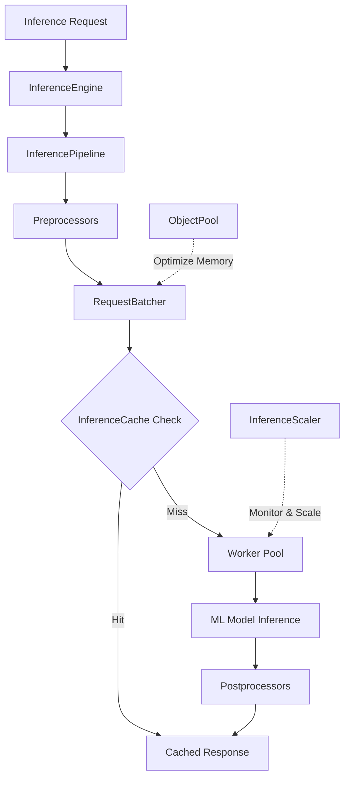

# Forge Inference Engine

Production-grade ML model serving infrastructure for high-throughput, low-latency inference with dynamic batching, auto-scaling, and intelligent caching.

## Table of Contents

- [Overview](#overview)
- [When to Use](#when-to-use)
- [When NOT to Use](#when-not-to-use)
- [Architecture](#architecture)
- [Quick Start](#quick-start)
- [Configuration](#configuration)
- [Components](#components)
- [Monitoring](#monitoring)
- [Examples](#examples)

## Overview

The Forge Inference Engine is a complete ML model serving solution designed for production environments. It provides:

- **Dynamic Batching**: Adaptive batch sizing with multiple strategies
- **Auto-Scaling**: CPU/Memory-based worker scaling
- **Intelligent Caching**: LRU/LFU eviction with TTL
- **Processing Pipelines**: Pre/post processing stages
- **High Performance**: Object pooling and memory optimization
- **Production Ready**: Health checks, metrics, and observability

## When to Use

Use Forge Inference Engine when you need:

- **Custom ML Model Serving**: TensorFlow, PyTorch, ONNX, or custom models
- **High-Throughput Batch Inference**: Process thousands of requests efficiently
- **Real-Time Inference with SLAs**: Low-latency serving with guaranteed performance
- **Multi-Model Serving**: Host multiple models with resource sharing
- **Resource Optimization**: Auto-scaling and efficient resource utilization
- **Production Reliability**: Health checks, circuit breakers, and monitoring

### Ideal Use Cases

- Computer vision APIs (image classification, object detection)
- NLP model serving (sentiment analysis, NER, text classification)
- Recommendation systems
- Fraud detection systems
- Real-time scoring services
- Batch prediction jobs

## When NOT to Use

Consider alternatives if:

- **Simple LLM API Calls**: Use `ai-sdk` directly for OpenAI, Anthropic, etc.
- **Prototype/Development**: Overkill for simple experimentation
- **Stateless Single Requests**: Direct model.Predict() is simpler
- **No Batching Needed**: Simple HTTP wrapper may suffice

## Architecture



### Request Flow

1. **Request arrives** at InferenceEngine
2. **Pipeline preprocessing** transforms input data
3. **Request batching** groups requests for efficiency
4. **Cache lookup** checks for existing results
5. **Worker execution** processes batched requests
6. **Pipeline postprocessing** transforms outputs
7. **Response returned** to caller

## Quick Start

### Basic Setup

```go
package main

import (
    "context"
    "log"
    
    "github.com/xraph/forge/extensions/ai/inference"
)

func main() {
    // Create inference engine
    engine := inference.NewInferenceEngine(inference.InferenceConfig{
        Workers:        4,
        BatchSize:      10,
        BatchTimeout:   100 * time.Millisecond,
        EnableBatching: true,
        EnableCaching:  true,
        EnableScaling:  true,
        CacheSize:      1000,
        CacheTTL:       1 * time.Hour,
    })
    
    // Register your ML model
    model := LoadYourModel("path/to/model")
    engine.RegisterModel("my-model", model)
    
    // Start serving
    ctx := context.Background()
    if err := engine.Start(ctx); err != nil {
        log.Fatal(err)
    }
    defer engine.Stop(ctx)
    
    // Make inference request
    result, err := engine.Infer(ctx, inference.InferenceRequest{
        ModelID: "my-model",
        Input:   yourInputData,
    })
    if err != nil {
        log.Fatal(err)
    }
    
    log.Printf("Result: %v", result.Output)
}
```

### With Pipeline Processing

```go
// Add preprocessing
engine.AddPreprocessor(func(ctx context.Context, req inference.InferenceRequest) (inference.InferenceRequest, error) {
    // Normalize, resize, etc.
    req.Input = normalizeInput(req.Input)
    return req, nil
})

// Add postprocessing
engine.AddPostprocessor(func(ctx context.Context, resp inference.InferenceResponse) (inference.InferenceResponse, error) {
    // Format output, apply thresholds, etc.
    resp.Output = formatOutput(resp.Output)
    return resp, nil
})
```

## Configuration

### InferenceConfig

| Field | Type | Default | Description |
|-------|------|---------|-------------|
| `Workers` | int | 4 | Number of worker goroutines |
| `BatchSize` | int | 10 | Maximum requests per batch |
| `BatchTimeout` | duration | 100ms | Max wait time before processing batch |
| `CacheSize` | int | 1000 | Maximum cached entries |
| `CacheTTL` | duration | 1h | Cache entry time-to-live |
| `MaxQueueSize` | int | 10000 | Maximum queued requests |
| `RequestTimeout` | duration | 30s | Per-request timeout |
| `EnableBatching` | bool | true | Enable request batching |
| `EnableCaching` | bool | true | Enable response caching |
| `EnableScaling` | bool | true | Enable auto-scaling |
| `ScalingThreshold` | float64 | 0.8 | Threshold to trigger scaling (0-1) |
| `MaxWorkers` | int | 20 | Maximum workers for auto-scaling |
| `MinWorkers` | int | 2 | Minimum workers for auto-scaling |

### Batching Strategies

```go
// Dynamic batching (default)
config.EnableDynamic = true

// Fixed batch size
config.EnableDynamic = false
config.BatchSize = 32

// Custom batching strategy
strategy := &MyCustomBatchingStrategy{}
batcher.SetStrategy(strategy)
```

### Caching Policies

```go
// LRU (Least Recently Used)
cache := inference.NewInferenceCache(inference.CacheConfig{
    Policy: inference.CachePolicyLRU,
    Size:   1000,
    TTL:    1 * time.Hour,
})

// LFU (Least Frequently Used)
cache := inference.NewInferenceCache(inference.CacheConfig{
    Policy: inference.CachePolicyLFU,
    Size:   1000,
    TTL:    1 * time.Hour,
})
```

## Components

### 1. InferenceEngine (`engine.go`)

Core orchestration component that coordinates all inference operations.

**Key Features:**
- Multi-worker request processing
- Health monitoring and stats
- Graceful shutdown
- Request routing

### 2. RequestBatcher (`batching.go`)

Dynamic batching system that groups requests for optimal throughput.

**Batching Strategies:**
- **Fixed**: Static batch size
- **Dynamic**: Adapts to queue depth
- **Model-Aware**: Optimizes per model type
- **Custom**: Implement your own

**Metrics:**
- Average batch size
- Wait time
- Processing time
- Queue depth

### 3. InferenceCache (`caching.go`)

Intelligent caching with multiple eviction policies.

**Features:**
- LRU/LFU eviction
- TTL-based expiration
- Cache warming
- Hit rate tracking

### 4. InferenceScaler (`scaling.go`)

Auto-scaling system that adjusts workers based on load.

**Scaling Triggers:**
- CPU utilization
- Memory usage
- Queue depth
- Custom metrics

**Strategies:**
- CPU/Memory-based
- Queue-based
- Custom strategies

### 5. InferencePipeline (`pipeline.go`)

Request/response processing pipeline.

**Capabilities:**
- Pre-processing stages
- Post-processing stages
- Pipeline interceptors
- Error handling

### 6. ObjectPool (`pool.go`)

Memory optimization through object reuse.

**Pooled Objects:**
- Inference requests
- Inference responses
- Intermediate buffers

## Monitoring

### Health Checks

```go
// Get engine health
health := engine.Health(ctx)
fmt.Printf("Status: %s\n", health.Status)
fmt.Printf("Active Workers: %d\n", health.ActiveWorkers)
fmt.Printf("Queue Size: %d\n", health.QueueSize)
```

### Statistics

```go
// Get detailed stats
stats := engine.Stats()
fmt.Printf("Requests Processed: %d\n", stats.RequestsProcessed)
fmt.Printf("Cache Hit Rate: %.2f%%\n", stats.CacheHitRate * 100)
fmt.Printf("Average Latency: %s\n", stats.AverageLatency)
fmt.Printf("Throughput: %.2f req/s\n", stats.ThroughputPerSec)
```

### Metrics Integration

```go
// Export to Prometheus
engine.RegisterMetrics(prometheusRegistry)

// Custom metrics
if metrics != nil {
    metrics.Counter("inference.requests").Inc()
    metrics.Histogram("inference.latency").Observe(latency)
}
```

### Key Metrics

| Metric | Description | Type |
|--------|-------------|------|
| `inference.requests.total` | Total requests received | Counter |
| `inference.requests.success` | Successful inferences | Counter |
| `inference.requests.error` | Failed inferences | Counter |
| `inference.latency` | Request latency | Histogram |
| `inference.batch.size` | Batch size distribution | Histogram |
| `inference.cache.hits` | Cache hits | Counter |
| `inference.cache.misses` | Cache misses | Counter |
| `inference.workers.active` | Active workers | Gauge |
| `inference.queue.size` | Queue depth | Gauge |

## Examples

See [`examples/`](examples/) directory for complete examples:

- **[TensorFlow Serving](examples/tensorflow_serving.go)** - Serve TensorFlow models
- **[PyTorch Serving](examples/pytorch_serving.go)** - Serve PyTorch models
- **[Batch Inference](examples/batch_inference.go)** - High-throughput batching
- **[Pipeline Processing](examples/pipeline_example.go)** - Pre/post processing

## Advanced Usage

### Custom Worker Implementation

```go
type CustomWorker struct {
    // Your custom fields
}

func (w *CustomWorker) Process(ctx context.Context, batch *RequestBatch) error {
    // Your custom processing logic
    return nil
}

engine.RegisterWorkerFactory(func() InferenceWorker {
    return &CustomWorker{}
})
```

### Multi-Model Serving

```go
// Register multiple models
engine.RegisterModel("resnet50", resnet50Model)
engine.RegisterModel("mobilenet", mobilenetModel)
engine.RegisterModel("efficientnet", efficientnetModel)

// Route requests by model ID
result, _ := engine.Infer(ctx, inference.InferenceRequest{
    ModelID: "resnet50",
    Input:   imageData,
})
```

### A/B Testing

```go
// Route 10% traffic to new model version
engine.AddInterceptor(func(req InferenceRequest) InferenceRequest {
    if rand.Float64() < 0.1 {
        req.ModelID = "my-model-v2"
    }
    return req
})
```

## Performance Tips

1. **Tune Batch Size**: Larger batches = higher throughput, but higher latency
2. **Enable Caching**: For deterministic models with repeated inputs
3. **Use Object Pooling**: Reduces GC pressure for high-throughput scenarios
4. **Monitor Queue Depth**: High queue = need more workers or larger batches
5. **Profile Your Model**: Understand model-specific bottlenecks

## Comparison with AI-SDK

| Feature | Forge Inference | AI-SDK |
|---------|----------------|--------|
| **Purpose** | ML model serving | LLM operations |
| **Batching** | Dynamic strategies | Simple timeout-based |
| **Caching** | LRU/LFU policies | Semantic similarity |
| **Scaling** | Auto-scaling | Not applicable |
| **Pipelines** | Pre/post processing | Not applicable |
| **Use Case** | Custom models | API-based LLMs |

See [`docs/INFERENCE_VS_AISDK.md`](../docs/INFERENCE_VS_AISDK.md) for detailed comparison.

## Contributing

See main Forge [CONTRIBUTING.md](../../../CONTRIBUTING.md) for guidelines.

## License

Part of the Forge framework. See [LICENSE](../../../LICENSE) for details.
