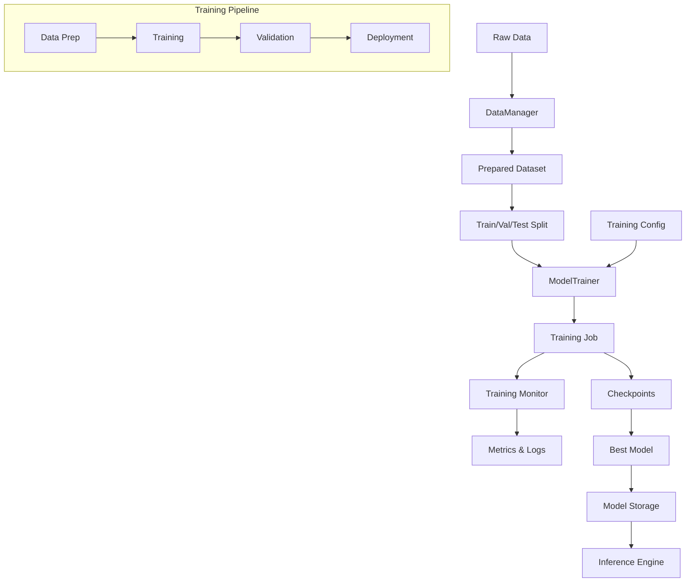

# Forge Training Package

Build and train custom machine learning models from your own data with production-grade training infrastructure.

## Table of Contents

- [Overview](#overview)
- [When to Use](#when-to-use)
- [Architecture](#architecture)
- [Quick Start](#quick-start)
- [Components](#components)
- [Configuration](#configuration)
- [Training Workflows](#training-workflows)
- [Monitoring & Metrics](#monitoring--metrics)
- [Integration with Inference](#integration-with-inference)
- [Examples](#examples)

## Overview

The Training package provides a complete ML training infrastructure for building custom models from your data. It handles the entire training lifecycle from data preparation to model deployment.

**Key Capabilities:**
- **Model Training**: TensorFlow, PyTorch, Scikit-learn, XGBoost support
- **Data Management**: Dataset preparation, validation, transformations
- **Training Pipelines**: Multi-stage workflows with dependencies
- **Monitoring**: Real-time metrics, progress tracking, resource utilization
- **Checkpointing**: Automatic model saving and recovery
- **Early Stopping**: Prevent overfitting with configurable strategies
- **Hyperparameter Management**: Learning rate scheduling, optimizer configuration

## When to Use

Use the Training package when you need to:

- **Build Custom Models**: Train models specific to your domain and data
- **Own Your Models**: Control the entire training process and model artifacts
- **Leverage Your Data**: Have labeled training data for supervised learning
- **Optimize for Your Use Case**: Fine-tune models for specific performance requirements
- **Reduce API Costs**: Train once, serve indefinitely without per-request costs

### Ideal Use Cases

- **Fraud Detection**: Custom models trained on your transaction patterns
- **Customer Churn Prediction**: Learn from your customer behavior data
- **Recommendation Systems**: Personalized recommendations based on user history
- **Text Classification**: Domain-specific categorization (support tickets, reviews)
- **Image Recognition**: Custom object detection or classification
- **Anomaly Detection**: Learn normal patterns from your operational data
- **Time Series Forecasting**: Predict metrics based on historical trends

## Architecture



### Component Overview

1. **ModelTrainer**: Orchestrates training jobs
2. **DataManager**: Handles datasets and data sources
3. **PipelineManager**: Manages multi-stage training workflows
4. **TrainingMonitor**: Tracks metrics and resource usage
5. **ModelStorage**: Persists trained models

## Quick Start

### Option 1: With AI Extension (Recommended)

The easiest way to use training is through the AI extension with dependency injection:

```go
package main

import (
    "context"
    "log"
    
    "github.com/xraph/forge"
    "github.com/xraph/forge/extensions/ai"
)

func main() {
    ctx := context.Background()
    
    // 1. Create app
    app := forge.NewApp(forge.Config{
        Name:    "ml-app",
        Version: "1.0.0",
    })
    
    // 2. Enable training in AI extension
    aiExt := ai.NewExtension(
        ai.WithEnableTraining(true),
        ai.WithTrainingConfig(ai.TrainingConfiguration{
            Enabled:           true,
            CheckpointPath:    "./checkpoints",
            ModelPath:         "./models",
            MaxConcurrentJobs: 5,
        }),
    )
    
    app.UseExtension(aiExt)
    app.Start(ctx)
    defer app.Stop(ctx)
    
    // 3. Resolve services from DI
    trainer, _ := forge.InjectType[ai.ModelTrainer](app.Container())
    dataManager, _ := forge.InjectType[ai.DataManager](app.Container())
    
    // 4. Use training services
    job, _ := trainer.StartTraining(ctx, ai.TrainingRequest{
        ID:        "my-model",
        ModelType: "classification",
    })
    
    log.Printf("Training started: %s", job.ID())
}
```

**See complete example**: [`examples/extension_integration.go`](examples/extension_integration.go)

### Option 2: Direct Instantiation

For standalone use without the extension:

```go
package main

import (
    "context"
    "log"
    
    "github.com/xraph/forge"
    "github.com/xraph/forge/extensions/ai/training"
)

func main() {
    ctx := context.Background()
    
    // Create logger and metrics
    logger := forge.NewLogger(forge.LoggerConfig{})
    metrics := forge.NewMetrics(forge.MetricsConfig{})
    
    // 1. Prepare dataset
    dataManager := training.NewDataManager(logger, metrics)
    dataset, _ := dataManager.CreateDataset(ctx, training.DatasetConfig{
        ID:   "customer-churn",
        Name: "Customer Churn Dataset",
        Type: training.DatasetTypeTabular,
        Source: myDataSource, // Implement DataSource interface
    })
    
    // Split into train/validation/test
    splits, _ := dataset.Split(ctx, []float64{0.7, 0.15, 0.15})
    
    // 2. Configure training
    trainer := training.NewModelTrainer(logger, metrics)
    job, _ := trainer.StartTraining(ctx, training.TrainingRequest{
        ID:        "churn-model-v1",
        ModelType: "classification",
        ModelConfig: training.ModelConfig{
            Architecture: "xgboost",
            Framework:    "xgboost",
        },
        TrainingConfig: training.TrainingConfig{
            Epochs:       100,
            BatchSize:    32,
            LearningRate: 0.001,
            Optimizer:    "adam",
            EarlyStopping: training.EarlyStoppingConfig{
                Enabled:  true,
                Patience: 10,
                Metric:   "val_loss",
            },
            Checkpoints: training.CheckpointConfig{
                Enabled:    true,
                SaveBest:   true,
                SaveLatest: true,
                Path:       "./checkpoints",
            },
        },
        DatasetConfig: training.DatasetConfig{
            TrainSet:      splits[0].ID(),
            ValidationSet: splits[1].ID(),
        },
    })
    
    // 3. Monitor training
    for {
        status, _ := trainer.GetTrainingStatus(job.ID())
        if status == training.TrainingStatusCompleted || 
           status == training.TrainingStatusFailed {
            break
        }
        
        metrics, _ := trainer.GetTrainingMetrics(job.ID())
        log.Printf("Epoch %d/%d - Loss: %.4f - Accuracy: %.4f",
            metrics.Epoch, metrics.TotalEpochs,
            metrics.TrainingLoss, metrics.Accuracy)
        
        time.Sleep(5 * time.Second)
    }
    
    // 4. Save trained model
    trainer.SaveModel(ctx, job.ID(), "./models/churn_model.pkl")
}
```

## Components

### 1. ModelTrainer

Manages the complete training lifecycle.

#### Key Methods

```go
type ModelTrainer interface {
    // Training lifecycle
    StartTraining(ctx context.Context, request TrainingRequest) (TrainingJob, error)
    StopTraining(ctx context.Context, jobID string) error
    ResumeTraining(ctx context.Context, jobID string) error
    
    // Model management
    SaveModel(ctx context.Context, jobID string, path string) error
    LoadModel(ctx context.Context, path string) (TrainedModel, error)
    ExportModel(ctx context.Context, jobID string, format string) ([]byte, error)
    
    // Monitoring
    GetTrainingMetrics(jobID string) (TrainingMetrics, error)
    GetTrainingLogs(jobID string) ([]TrainingLogEntry, error)
    GetTrainingStatus(jobID string) (TrainingStatus, error)
}
```

#### Training Job States

- `pending`: Queued for execution
- `running`: Currently training
- `paused`: Temporarily stopped, can resume
- `completed`: Successfully finished
- `failed`: Error occurred
- `cancelled`: Manually stopped

### 2. DataManager

Handles dataset preparation and validation.

#### Key Methods

```go
type DataManager interface {
    // Dataset management
    CreateDataset(ctx context.Context, config DatasetConfig) (Dataset, error)
    LoadDataset(ctx context.Context, source DataSource) (Dataset, error)
    
    // Data sources
    RegisterDataSource(source DataSource) error
    GetDataSource(sourceID string) (DataSource, error)
    
    // Data pipeline
    CreatePipeline(config DataPipelineConfig) (DataPipeline, error)
}
```

#### Dataset Operations

```go
type Dataset interface {
    // Data access
    GetRecords(ctx context.Context, offset, limit int) ([]DataRecord, error)
    GetBatch(ctx context.Context, batchSize int) (DataBatch, error)
    Iterator(ctx context.Context) (DataIterator, error)
    
    // Transformations
    Transform(ctx context.Context, transformer DataTransformer) (Dataset, error)
    Filter(ctx context.Context, filter DataFilter) (Dataset, error)
    Split(ctx context.Context, ratios []float64) ([]Dataset, error)
    
    // Metadata
    GetSchema() DataSchema
    GetStatistics() DataStatistics
}
```

### 3. PipelineManager

Orchestrates multi-stage training workflows.

#### Key Methods

```go
type PipelineManager interface {
    // Pipeline management
    CreatePipeline(config PipelineConfig) (TrainingPipeline, error)
    ExecutePipeline(ctx context.Context, pipelineID string, input PipelineInput) (PipelineExecution, error)
    
    // Templates
    CreateTemplate(template PipelineTemplate) error
    CreateFromTemplate(templateID string, config map[string]any) (TrainingPipeline, error)
}
```

#### Pipeline Stages

- **DataPreparation**: Load and clean data
- **DataValidation**: Validate schema and quality
- **FeatureExtraction**: Engineer features
- **ModelTraining**: Train the model
- **ModelValidation**: Validate on test set
- **ModelEvaluation**: Compute final metrics
- **ModelDeployment**: Export for inference

## Configuration

### Training Configuration

```go
type TrainingConfig struct {
    // Basic settings
    Epochs         int     `json:"epochs"`
    BatchSize      int     `json:"batch_size"`
    LearningRate   float64 `json:"learning_rate"`
    Optimizer      string  `json:"optimizer"`      // adam, sgd, rmsprop
    LossFunction   string  `json:"loss_function"`  // mse, cross_entropy, etc.
    
    // Regularization
    Regularization RegularizationConfig `json:"regularization"`
    
    // Early stopping
    EarlyStopping EarlyStoppingConfig `json:"early_stopping"`
    
    // Learning rate scheduling
    LRScheduler LearningRateScheduler `json:"lr_scheduler"`
    
    // Checkpointing
    Checkpoints CheckpointConfig `json:"checkpoints"`
}
```

### Dataset Configuration

```go
type DatasetConfig struct {
    ID          string           `json:"id"`
    Name        string           `json:"name"`
    Type        DatasetType      `json:"type"` // tabular, image, text, etc.
    Source      DataSource       `json:"source"`
    Schema      DataSchema       `json:"schema"`
    Validation  ValidationRules  `json:"validation"`
    Processing  ProcessingConfig `json:"processing"`
}
```

### Processing Configuration

```go
type ProcessingConfig struct {
    Transformations []TransformationConfig   `json:"transformations"`
    Normalization   NormalizationConfig      `json:"normalization"`
    Encoding        EncodingConfig           `json:"encoding"`
    FeatureEng      FeatureEngineeringConfig `json:"feature_engineering"`
    Sampling        SamplingConfig           `json:"sampling"`
    Augmentation    AugmentationConfig       `json:"augmentation"`
}
```

## Training Workflows

### Workflow 1: Basic Supervised Learning

```go
// 1. Load data
dataset := dataManager.CreateDataset(ctx, datasetConfig)

// 2. Split data
splits, _ := dataset.Split(ctx, []float64{0.8, 0.1, 0.1})

// 3. Train model
job, _ := trainer.StartTraining(ctx, trainingRequest)

// 4. Monitor until complete
for job.Status() == training.TrainingStatusRunning {
    metrics := job.GetMetrics()
    log.Printf("Progress: %.1f%%", metrics.Progress*100)
    time.Sleep(5 * time.Second)
}

// 5. Save model
trainer.SaveModel(ctx, job.ID(), "./models/model.pkl")
```

### Workflow 2: Training Pipeline

```go
// 1. Create pipeline
pipeline := pipelineManager.CreatePipeline(training.PipelineConfig{
    ID:   "training-pipeline",
    Name: "ML Training Pipeline",
    Stages: []training.StageConfig{
        {
            ID:   "data-prep",
            Type: training.StageTypeDataPreparation,
            Parameters: map[string]any{
                "source": "s3://my-bucket/data",
            },
        },
        {
            ID:   "training",
            Type: training.StageTypeModelTraining,
            Dependencies: []string{"data-prep"},
            Parameters: map[string]any{
                "epochs":    100,
                "batch_size": 32,
            },
        },
        {
            ID:   "validation",
            Type: training.StageTypeModelValidation,
            Dependencies: []string{"training"},
        },
    },
})

// 2. Execute pipeline
execution, _ := pipeline.Execute(ctx, training.PipelineInput{
    Data: inputData,
})

// 3. Get results
output := execution.Output()
```

### Workflow 3: Hyperparameter Tuning

```go
// Define hyperparameter search space
searchSpace := map[string][]any{
    "learning_rate": {0.001, 0.01, 0.1},
    "batch_size":    {16, 32, 64},
    "hidden_units":  {64, 128, 256},
}

// Try each combination
bestJob := nil
bestMetric := 0.0

for _, lr := range searchSpace["learning_rate"] {
    for _, bs := range searchSpace["batch_size"] {
        job, _ := trainer.StartTraining(ctx, training.TrainingRequest{
            TrainingConfig: training.TrainingConfig{
                LearningRate: lr.(float64),
                BatchSize:    bs.(int),
            },
        })
        
        // Wait for completion
        // Track best performing model
    }
}
```

## Monitoring & Metrics

### Training Metrics

```go
type TrainingMetrics struct {
    // Progress
    Epoch         int     `json:"epoch"`
    TotalEpochs   int     `json:"total_epochs"`
    Progress      float64 `json:"progress"`
    
    // Loss
    TrainingLoss   float64 `json:"training_loss"`
    ValidationLoss float64 `json:"validation_loss"`
    BestLoss       float64 `json:"best_loss"`
    BestEpoch      int     `json:"best_epoch"`
    
    // Performance
    Accuracy      float64 `json:"accuracy"`
    Precision     float64 `json:"precision"`
    Recall        float64 `json:"recall"`
    F1Score       float64 `json:"f1_score"`
    
    // Resources
    ResourceUsage ResourceUsageMetrics `json:"resource_usage"`
    
    // Learning
    LearningRate float64 `json:"learning_rate"`
    GradientNorm float64 `json:"gradient_norm"`
}
```

### Monitoring Example

```go
// Get real-time metrics
metrics, _ := trainer.GetTrainingMetrics(jobID)

fmt.Printf("Epoch: %d/%d\n", metrics.Epoch, metrics.TotalEpochs)
fmt.Printf("Training Loss: %.4f\n", metrics.TrainingLoss)
fmt.Printf("Validation Loss: %.4f\n", metrics.ValidationLoss)
fmt.Printf("Accuracy: %.2f%%\n", metrics.Accuracy*100)
fmt.Printf("GPU Usage: %.1f%%\n", metrics.ResourceUsage.GPUUsage)

// Get training logs
logs, _ := trainer.GetTrainingLogs(jobID)
for _, entry := range logs {
    fmt.Printf("[%s] %s: %s\n", 
        entry.Timestamp.Format(time.RFC3339),
        entry.Level,
        entry.Message)
}
```

### Resource Monitoring

```go
type ResourceUsageMetrics struct {
    CPUUsage       float64 `json:"cpu_usage"`        // 0-1
    MemoryUsage    int64   `json:"memory_usage"`     // bytes
    MemoryTotal    int64   `json:"memory_total"`     // bytes
    GPUUsage       float64 `json:"gpu_usage"`        // 0-1
    GPUMemory      int64   `json:"gpu_memory"`       // bytes
    GPUMemoryTotal int64   `json:"gpu_memory_total"` // bytes
}
```

## Integration with Inference

The training package produces models that can be directly served by the [Inference Engine](../inference/README.md).

### Complete Workflow

```go
// 1. TRAINING PHASE
trainer := training.NewModelTrainer(logger, metrics)
job, _ := trainer.StartTraining(ctx, trainingRequest)

// Wait for completion...

// Save trained model
trainer.SaveModel(ctx, job.ID(), "./models/my_model.pkl")

// 2. INFERENCE PHASE
inferenceEngine := inference.NewInferenceEngine(inference.InferenceConfig{
    Workers:        4,
    BatchSize:      16,
    EnableBatching: true,
    EnableCaching:  true,
})

// Load the trained model
model := LoadTrainedModel("./models/my_model.pkl")
inferenceEngine.RegisterModel("my-model", model)
inferenceEngine.Start(ctx)

// 3. SERVE PREDICTIONS
result, _ := inferenceEngine.Infer(ctx, inference.InferenceRequest{
    ModelID: "my-model",
    Input:   newData,
})

fmt.Printf("Prediction: %v\n", result.Output)
```

### Model Export Formats

```go
// Export as pickle (Python models)
data, _ := trainer.ExportModel(ctx, jobID, "pickle")

// Export as ONNX (framework-agnostic)
data, _ := trainer.ExportModel(ctx, jobID, "onnx")

// Export as TensorFlow SavedModel
data, _ := trainer.ExportModel(ctx, jobID, "savedmodel")

// Export as PyTorch state dict
data, _ := trainer.ExportModel(ctx, jobID, "torch")
```

## Extension Integration

### Enabling Training

Training is **optional** and disabled by default. Enable it via configuration:

```go
import "github.com/xraph/forge/extensions/ai"

aiExt := ai.NewExtension(
    ai.WithEnableTraining(true), // Enable training
)
```

### Configuration Options

```go
ai.WithTrainingConfig(ai.TrainingConfiguration{
    Enabled:           true,                    // Enable/disable training
    CheckpointPath:    "./checkpoints",         // Where to save checkpoints
    ModelPath:         "./models",              // Where to save trained models
    DataPath:          "./data",                // Where to store datasets
    MaxConcurrentJobs: 5,                       // Max parallel training jobs
    DefaultResources: ai.ResourcesConfig{
        CPU:      "8",                          // Default CPU allocation
        Memory:   "16Gi",                       // Default memory
        GPU:      1,                            // Default GPU count
        Timeout:  6 * time.Hour,                // Default job timeout
        Priority: 2,                            // Default priority
    },
    Storage: ai.StorageConfig{
        Type: "local", // local, s3, gcs, azure
        Local: &ai.LocalStorageConfig{
            BasePath: "./training-storage",
        },
    },
})
```

### Accessing Services via DI

```go
// By type (preferred)
trainer, _ := forge.InjectType[ai.ModelTrainer](app.Container())
dataManager, _ := forge.InjectType[ai.DataManager](app.Container())
pipelineManager, _ := forge.InjectType[ai.PipelineManager](app.Container())

// By key (backward compatible)
trainerByKey, _ := app.Container().Resolve(ai.ModelTrainerKey)
trainer := trainerByKey.(ai.ModelTrainer)
```

### Storage Backends

**Local Storage** (Development):
```go
Storage: ai.StorageConfig{
    Type: "local",
    Local: &ai.LocalStorageConfig{
        BasePath: "./training-storage",
    },
}
```

**AWS S3** (Production):
```go
Storage: ai.StorageConfig{
    Type: "s3",
    S3: &ai.S3StorageConfig{
        Bucket:    "ml-models-prod",
        Region:    "us-west-2",
        AccessKey: os.Getenv("AWS_ACCESS_KEY"),
        SecretKey: os.Getenv("AWS_SECRET_KEY"),
        Prefix:    "training/",
    },
}
```

**Google Cloud Storage**:
```go
Storage: ai.StorageConfig{
    Type: "gcs",
    GCS: &ai.GCSStorageConfig{
        Bucket:          "ml-training",
        ProjectID:       "my-project",
        CredentialsFile: "/path/to/creds.json",
        Prefix:          "models/",
    },
}
```

## Examples

See the [`examples/`](examples/) directory for complete working examples:

- **[extension_integration.go](examples/extension_integration.go)** - Using training with AI extension
- **[basic_training.go](examples/basic_training.go)** - Basic training workflow
- **[training_pipeline.go](examples/training_pipeline.go)** - Multi-stage pipeline
- **[train_to_inference.go](examples/train_to_inference.go)** - Complete training → inference
- **[dataset_management.go](examples/dataset_management.go)** - Data preparation and validation

## Best Practices

### 1. Data Preparation

- **Validate Early**: Check data quality before training
- **Split Properly**: Use stratified splits for imbalanced datasets
- **Normalize**: Scale features to similar ranges
- **Handle Missing Values**: Don't ignore nulls

### 2. Training Configuration

- **Start Simple**: Begin with default hyperparameters
- **Monitor Validation**: Watch for overfitting
- **Use Early Stopping**: Prevent wasted training time
- **Checkpoint Frequently**: Save progress regularly

### 3. Monitoring

- **Track Multiple Metrics**: Don't rely on loss alone
- **Monitor Resources**: Ensure efficient utilization
- **Log Everything**: Capture context for debugging
- **Set Alerts**: Be notified of failures

### 4. Model Management

- **Version Models**: Track training configs and data versions
- **Document Models**: Record what was trained and why
- **Test Before Deploy**: Validate on held-out test set
- **Monitor Production**: Track model performance over time

## Performance Tips

1. **Batch Size**: Larger batches = faster training, but more memory
2. **Learning Rate**: Start with 0.001 and adjust based on loss curve
3. **Data Loading**: Use parallel data loading and prefetching
4. **GPU Utilization**: Maximize batch size to use GPU efficiently
5. **Mixed Precision**: Use FP16 training for faster convergence

## Troubleshooting

### Training Not Starting

- Check dataset is properly loaded
- Verify GPU availability if using GPU
- Ensure sufficient memory
- Check training config validity

### Loss Not Decreasing

- Reduce learning rate
- Check data preprocessing
- Verify labels are correct
- Try different optimizer

### Out of Memory

- Reduce batch size
- Use gradient accumulation
- Enable mixed precision training
- Reduce model size

### Overfitting

- Add regularization (L1/L2, dropout)
- Reduce model complexity
- Get more training data
- Use data augmentation
- Enable early stopping

## API Reference

For REST API integration (future implementation), see [API_DESIGN.md](API_DESIGN.md).

## Comparison with Other Components

| Component | Training | Inference | AI Extension |
|-----------|----------|-----------|--------------|
| **Purpose** | Build models | Serve models | Use LLMs |
| **Phase** | Development | Production | Production |
| **Input** | Raw data | Features | Prompts |
| **Output** | Trained model | Predictions | Responses |
| **Duration** | Hours/days | Milliseconds | Seconds |
| **When to Use** | Custom models | High throughput | Chat/agents |

See [ML Lifecycle Guide](../docs/ML_LIFECYCLE_GUIDE.md) for detailed comparison.

## Contributing

See main Forge [CONTRIBUTING.md](../../../CONTRIBUTING.md) for guidelines.

## License

Part of the Forge framework. See [LICENSE](../../../LICENSE) for details.
