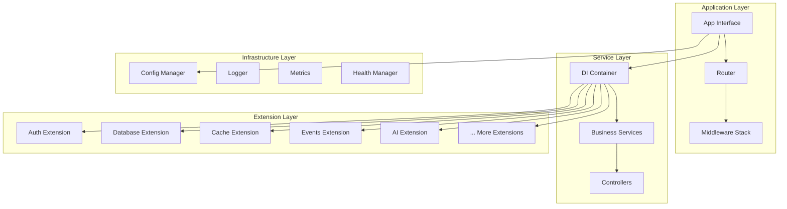
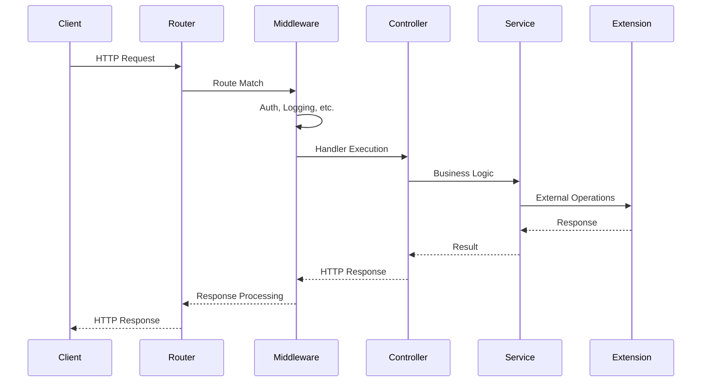

import { Card, Cards } from 'fumadocs-ui/components/card'
import { Callout } from 'fumadocs-ui/components/callout'
import { Tab, Tabs } from 'fumadocs-ui/components/tabs'

Forge v2 is built on **clean architecture principles** with a focus on modularity, testability, and maintainability. The framework provides a solid foundation for building enterprise-grade applications with clear separation of concerns and powerful dependency injection.

## Design Principles

<Cards>
  <Card
    title="🏗️ Clean Architecture"
    description="Clear separation between business logic, infrastructure, and presentation layers"
  />
  <Card
    title="🔌 Dependency Injection"
    description="Comprehensive DI system with lifecycle management and auto-discovery"
  />
  <Card
    title="🧩 Modular Design"
    description="Extension-based architecture allowing selective feature inclusion"
  />
  <Card
    title="📊 Observability First"
    description="Built-in metrics, logging, and health checks for production readiness"
  />
</Cards>

## Core Architecture

Forge v2 follows a layered architecture with the following components:



## Core Components

### App Interface

The `App` interface is the central coordinator that manages the application lifecycle:

```go
type App interface {
    // Core components
    Container() Container
    Router() Router
    ConfigManager() ConfigManager
    Logger() Logger
    Metrics() Metrics
    HealthManager() HealthManager
    
    // Lifecycle management
    Start(ctx context.Context) error
    Stop(ctx context.Context) error
    Run() error
    
    // Service registration
    RegisterService(factory Factory, options ...ServiceOption) error
    RegisterController(controller any, options ...ControllerOption) error
    RegisterExtension(ext Extension) error
    
    // Application metadata
    Name() string
    Version() string
    Environment() string
}
```

**Key Responsibilities:**
- **Lifecycle Management**: Coordinates startup and shutdown sequences
- **Component Integration**: Wires together all core components
- **Extension Management**: Loads and manages extensions
- **Configuration**: Provides centralized configuration access

### Dependency Injection Container

The DI container is the heart of Forge v2's architecture, providing comprehensive dependency management:

<Tabs items={['Container Interface', 'Service Lifecycle', 'Scoping']}>
  <Tab value="Container Interface">
    ```go
    type Container interface {
        // Service registration
        RegisterSingleton(factory Factory, options ...ServiceOption) error
        RegisterScoped(factory Factory, options ...ServiceOption) error
        RegisterTransient(factory Factory, options ...ServiceOption) error
        
        // Service resolution
        Resolve(serviceType reflect.Type) (any, error)
        ResolveNamed(name string) (any, error)
        
        // Scope management
        CreateScope() Scope
        
        // Lifecycle
        Start(ctx context.Context) error
        Stop(ctx context.Context) error
        
        // Introspection
        GetServices() []ServiceInfo
        GetService(name string) (ServiceInfo, bool)
    }
    ```
  </Tab>
  <Tab value="Service Lifecycle">
    **Automatic Lifecycle Management:**
    - **Start**: Services implementing `Service` interface are started automatically
    - **Stop**: Graceful shutdown with proper cleanup
    - **Health**: Services implementing `HealthChecker` are monitored
    - **Configuration**: Services implementing `Configurable` receive config updates
    
    ```go
    type Service interface {
        Start(ctx context.Context) error
        Stop(ctx context.Context) error
    }
    
    type HealthChecker interface {
        HealthCheck(ctx context.Context) error
    }
    
    type Configurable interface {
        Configure(config any) error
    }
    ```
  </Tab>
  <Tab value="Scoping">
    **Service Scopes:**
    - **Singleton**: One instance per container (default for most services)
    - **Scoped**: One instance per scope (e.g., HTTP request)
    - **Transient**: New instance every time
    
    ```go
    // Singleton - shared across application
    container.RegisterSingleton(func(c Container) (*UserService, error) {
        return &UserService{}, nil
    })
    
    // Scoped - new instance per HTTP request
    container.RegisterScoped(func(c Container) (*RequestContext, error) {
        return &RequestContext{}, nil
    })
    
    // Transient - new instance every time
    container.RegisterTransient(func(c Container) (*TempService, error) {
        return &TempService{}, nil
    })
    ```
  </Tab>
</Tabs>

### Router System

Forge v2 provides a flexible routing system with multiple backend support:

```go
type Router interface {
    // HTTP methods
    GET(path string, handler HandlerFunc, options ...RouteOption) Route
    POST(path string, handler HandlerFunc, options ...RouteOption) Route
    PUT(path string, handler HandlerFunc, options ...RouteOption) Route
    DELETE(path string, handler HandlerFunc, options ...RouteOption) Route
    PATCH(path string, handler HandlerFunc, options ...RouteOption) Route
    
    // Route groups
    Group(prefix string, options ...GroupOption) Router
    
    // Middleware
    Use(middleware ...Middleware)
    
    // Static files
    Static(prefix, root string)
    
    // Server management
    Start(ctx context.Context, addr string) error
    Stop(ctx context.Context) error
}
```

**Supported Router Backends:**
- **BunRouter**: High-performance router (default)
- **Chi**: Lightweight, idiomatic router
- **Gin**: Popular router with middleware ecosystem
- **Echo**: High-performance, minimalist framework
- **Gorilla Mux**: Powerful URL router and dispatcher

### Configuration Management

Centralized configuration with multiple sources and validation:

```go
type ConfigManager interface {
    // Configuration loading
    Load(key string, target any) error
    LoadWithDefaults(key string, target any, defaults any) error
    
    // Configuration sources
    AddSource(source ConfigSource) error
    
    // Validation
    Validate(config any, options ValidationOptions) error
    
    // Secrets management
    SecretsManager() SecretsManager
    
    // Hot reload
    Watch(key string, callback func(any)) error
}
```

**Configuration Sources:**
- **Environment Variables**: `APP_DATABASE_URL`
- **Configuration Files**: YAML, JSON, TOML
- **Command Line Arguments**: `--database-url`
- **Remote Sources**: Consul, etcd, AWS Parameter Store
- **Secrets Management**: HashiCorp Vault, AWS Secrets Manager

## Extension System

Extensions are the primary way to add functionality to Forge v2 applications:

### Extension Interface

```go
type Extension interface {
    // Metadata
    Name() string
    Version() string
    Description() string
    
    // Lifecycle
    Register(container Container) error
    Start(ctx context.Context) error
    Stop(ctx context.Context) error
    
    // Health and dependencies
    Health(ctx context.Context) error
    Dependencies() []string
}
```

### Optional Extension Interfaces

Extensions can implement additional interfaces for enhanced functionality:

<Tabs items={['Configurable', 'Observable', 'Hot Reload']}>
  <Tab value="Configurable">
    ```go
    type ConfigurableExtension interface {
        Extension
        Configure(config any) error
        ConfigKey() string
    }
    ```
    
    **Benefits:**
    - Automatic configuration loading from ConfigManager
    - Configuration validation
    - Hot reload support
  </Tab>
  <Tab value="Observable">
    ```go
    type ObservableExtension interface {
        Extension
        Metrics() map[string]any
        Logger() Logger
    }
    ```
    
    **Benefits:**
    - Automatic metrics collection
    - Structured logging integration
    - Observability dashboard integration
  </Tab>
  <Tab value="Hot Reload">
    ```go
    type HotReloadableExtension interface {
        Extension
        Reload(ctx context.Context) error
        CanReload() bool
    }
    ```
    
    **Benefits:**
    - Runtime configuration updates
    - Zero-downtime deployments
    - Development productivity
  </Tab>
</Tabs>

## Request Lifecycle

Understanding how requests flow through Forge v2:



### Request Scoping

Each HTTP request creates a new scope in the DI container:

- **Scope Creation**: New scope created for request
- **Service Resolution**: Scoped services instantiated
- **Request Processing**: Controllers and services execute
- **Scope Cleanup**: Scoped services disposed
- **Response**: HTTP response sent to client

## Error Handling

Forge v2 provides comprehensive error handling with structured errors:

```go
// Structured error with context
type ForgeError struct {
    Code    string                 `json:"code"`
    Message string                 `json:"message"`
    Details map[string]interface{} `json:"details,omitempty"`
    Cause   error                  `json:"-"`
}

// Error middleware for consistent error responses
func ErrorMiddleware() Middleware {
    return func(next HandlerFunc) HandlerFunc {
        return func(ctx Context) error {
            err := next(ctx)
            if err != nil {
                // Log error with context
                ctx.Logger().Error("request failed",
                    F("error", err),
                    F("path", ctx.Path()),
                    F("method", ctx.Method()),
                    F("trace_id", ctx.TraceID()),
                )
                
                // Return structured error response
                return ctx.JSON(500, ForgeError{
                    Code:    "INTERNAL_ERROR",
                    Message: "Internal server error",
                    Details: map[string]interface{}{
                        "trace_id": ctx.TraceID(),
                    },
                })
            }
            return nil
        }
    }
}
```

## Performance Considerations

<Callout type="info">
Forge v2 is optimized for high-performance applications with careful attention to memory allocation and concurrency.
</Callout>

### Key Optimizations

- **Connection Pooling**: Database and HTTP client connection reuse
- **Memory Pooling**: Object pooling for high-frequency allocations
- **Goroutine Management**: Controlled goroutine lifecycle
- **Caching**: Multi-level caching with TTL support
- **Compression**: Automatic response compression
- **Keep-Alive**: HTTP keep-alive for persistent connections

### Benchmarks

Typical performance characteristics:
- **Throughput**: 50,000+ requests/second (simple endpoints)
- **Latency**: &lt;1ms p50, &lt;5ms p99 (without database)
- **Memory**: ~10MB base memory footprint
- **Startup**: &lt;100ms cold start time

## Security Architecture

Security is built into every layer of Forge v2:

### Security Layers

1. **Transport Security**: TLS/HTTPS with modern cipher suites
2. **Authentication**: Multiple providers (OAuth2, SAML, JWT, API keys)
3. **Authorization**: RBAC, ABAC, and custom authorization
4. **Input Validation**: Request validation and sanitization
5. **Rate Limiting**: Per-user and global rate limiting
6. **Security Headers**: CORS, CSP, HSTS, and more

### Security Middleware

```go
// Security middleware stack
app.Router().Use(
    SecurityHeadersMiddleware(),
    CORSMiddleware(),
    RateLimitMiddleware(),
    AuthenticationMiddleware(),
    AuthorizationMiddleware(),
)
```

## Testing Architecture

Forge v2 provides comprehensive testing utilities:

### Test Utilities

```go
// Test application
app := forge.NewTestApp(t, forge.TestConfig{
    Extensions: []forge.Extension{
        database.NewExtension(),
        cache.NewExtension(),
    },
})

// Test HTTP endpoints
resp := app.GET("/api/users").
    WithHeader("Authorization", "Bearer token").
    Expect().
    Status(200).
    JSON()

// Test services
userService := forge.GetService[*UserService](app.Container())
user, err := userService.GetUser(ctx, "user-id")
require.NoError(t, err)
```

### Testing Patterns

- **Unit Tests**: Test individual components in isolation
- **Integration Tests**: Test component interactions
- **Contract Tests**: Test API contracts
- **End-to-End Tests**: Test complete user workflows

## Next Steps

<Cards>
  <Card
    title="🔌 Extensions"
    description="Learn about the extension system and available extensions"
    href="/docs/concepts/extensions"
  />
  <Card
    title="🔐 Security"
    description="Understand Forge v2's security features and best practices"
    href="/docs/concepts/security"
  />
  <Card
    title="📊 Observability"
    description="Explore monitoring, logging, and metrics capabilities"
    href="/docs/concepts/observability"
  />
  <Card
    title="🚀 Quick Start"
    description="Build your first Forge v2 application"
    href="/docs/quick-start"
  />
</Cards>