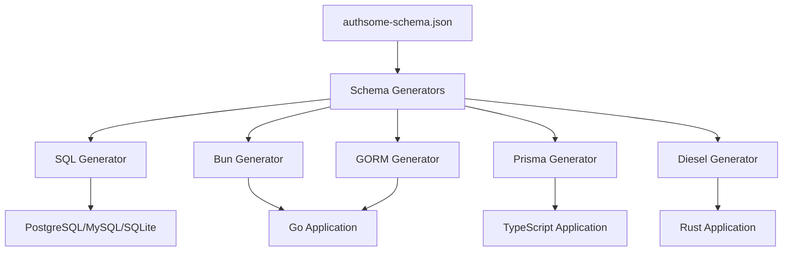

import { Tabs, Tab } from 'fumadocs-ui/components/tabs'
import { Callout } from 'fumadocs-ui/components/callout'
import { Steps, Step } from 'fumadocs-ui/components/steps'

# Multi-ORM Database Support

AuthSome provides a **schema-driven database abstraction layer** that allows you to use any ORM or database driver while maintaining a consistent schema. Choose the best tools for your stack without being locked into a specific ORM.

<Callout type="info">
AuthSome uses Bun by default, but you can generate migrations for GORM, Prisma, Diesel, or raw SQL without any code changes to AuthSome itself.
</Callout>

## Supported ORMs

| ORM | Language | Use Case |
|-----|----------|----------|
| **Bun** | Go | Default, best integration |
| **GORM** | Go | Popular Go ORM, large community |
| **Prisma** | TypeScript | Excellent DX, type safety |
| **Diesel** | Rust | Compile-time query checking |
| **SQL** | Any | Maximum control, no ORM overhead |

## Architecture



The schema definition (`authsome-schema.json`) is the single source of truth. Generators create ORM-specific migrations that produce identical database schemas.

## Quick Start

### Initialize with Your ORM

<Tabs>
<Tab value="bun" title="Bun (Default)">
```bash
authsome init --orm=bun --dialect=postgres
```

Output:
```
✓ Created authsome-schema.json (v1.0)
✓ Created authsome.yaml (standalone mode)
✓ Generated bun migrations
```
</Tab>

<Tab value="gorm" title="GORM">
```bash
authsome init --orm=gorm --dialect=postgres
```

Generates:
- `migrations/models.go` - GORM model structs
- `migrations/migrate.go` - AutoMigrate function
</Tab>

<Tab value="prisma" title="Prisma">
```bash
authsome init --orm=prisma
```

Generates:
- `prisma/schema.prisma` - Prisma schema file

Next steps:
```bash
cd prisma
npx prisma migrate dev --name initial
npx prisma generate
```
</Tab>

<Tab value="diesel" title="Diesel (Rust)">
```bash
authsome init --orm=diesel
```

Generates timestamped migration directory with up/down SQL.

Next steps:
```bash
diesel migration run
diesel print-schema > src/schema.rs
```
</Tab>

<Tab value="sql" title="Raw SQL">
```bash
authsome init --orm=sql --dialect=postgres
```

Generates:
- `migrations/001_initial_up.sql` - CREATE statements
- `migrations/001_initial_down.sql` - DROP statements

Apply with your preferred SQL tool:
```bash
psql -d yourdb < migrations/001_initial_up.sql
```
</Tab>
</Tabs>

## Schema Management

### Extract Schema

Extract the AuthSome schema from Go structs:

```bash
authsome schema extract --input=./schema --output=authsome-schema.json
```

This creates a JSON representation of all database tables, which you can:
- Version control alongside your code
- Customize for your needs
- Use to generate migrations for any ORM

### Validate Schema

Ensure your schema is valid:

```bash
authsome schema validate --schema=authsome-schema.json
```

Checks for:
- Required fields present
- Valid field types
- Correct references
- Primary key definitions

### Schema Information

View detailed schema info:

```bash
authsome schema info --schema=authsome-schema.json
```

Output:
```
Schema Information
==================

Version: 1.0
Description: AuthSome Database Schema

Models: 39

  User
    Table: users
    Fields: 12
    Indexes: 1
    Relations: 2
  ...
```

### Compare Schemas

Diff two schema versions:

```bash
authsome schema diff --from=v1-schema.json --to=v2-schema.json
```

Shows added, removed, and modified models.

## Migration Generation

### Generate for Any ORM

<Tabs>
<Tab value="bun-gen" title="Bun">
```bash
authsome generate migrations \
  --orm=bun \
  --schema=authsome-schema.json \
  --output=./migrations
```

Generates Go migration file compatible with Bun's migration system.
</Tab>

<Tab value="gorm-gen" title="GORM">
```bash
authsome generate migrations \
  --orm=gorm \
  --schema=authsome-schema.json \
  --output=./models
```

Generates:
```go
// models.go
type User struct {
    ID            string    `gorm:"primaryKey;type:varchar(20)"`
    Email         string    `gorm:"uniqueIndex;not null"`
    EmailVerified bool      `gorm:"default:false;not null"`
    CreatedAt     time.Time `gorm:"autoCreateTime"`
}

// migrate.go
func AutoMigrate(db *gorm.DB) error {
    return db.AutoMigrate(&User{}, &Session{}, ...)
}
```
</Tab>

<Tab value="prisma-gen" title="Prisma">
```bash
authsome generate migrations \
  --orm=prisma \
  --schema=authsome-schema.json \
  --output=./prisma
```

Generates `schema.prisma`:
```prisma
model User {
  id            String   @id @db.VarChar(20)
  email         String   @unique @db.VarChar(255)
  emailVerified Boolean  @default(false) @map("email_verified")
  sessions      Session[]
  
  @@index([email])
  @@map("users")
}
```
</Tab>

<Tab value="diesel-gen" title="Diesel">
```bash
authsome generate migrations \
  --orm=diesel \
  --schema=authsome-schema.json \
  --output=./migrations
```

Generates timestamped directory:
```
migrations/
  2024-10-17-120000_authsome_initial/
    up.sql
    down.sql
```
</Tab>

<Tab value="sql-gen" title="SQL">
```bash
authsome generate migrations \
  --orm=sql \
  --dialect=postgres \
  --schema=authsome-schema.json \
  --output=./migrations
```

Choose dialect: `postgres`, `mysql`, or `sqlite`

Generates:
```sql
-- 001_initial_up.sql
CREATE TABLE users (
    id VARCHAR(20) PRIMARY KEY,
    email VARCHAR(255) NOT NULL UNIQUE,
    email_verified BOOLEAN NOT NULL DEFAULT false,
    created_at TIMESTAMP NOT NULL DEFAULT CURRENT_TIMESTAMP
);
```
</Tab>
</Tabs>

## Switching ORMs

You can switch ORMs without changing AuthSome code:

<Steps>
<Step>
### Extract Current Schema

```bash
authsome schema extract --output=authsome-schema.json
```
</Step>

<Step>
### Generate for New ORM

```bash
# Switching from Bun to GORM
authsome generate migrations --orm=gorm --output=./models
```
</Step>

<Step>
### Review Generated Code

Check the generated models/migrations to ensure they match your needs.
</Step>

<Step>
### Update Application Code

Change your application to use the new ORM while AuthSome continues to work unchanged.
</Step>
</Steps>

## Custom Schema

Extend the AuthSome schema with your own fields:

### 1. Extract Base Schema

```bash
authsome schema extract --output=my-schema.json
```

### 2. Edit Schema

Add custom fields to `my-schema.json`:

```json
{
  "models": {
    "User": {
      "fields": [
        {
          "name": "CompanyName",
          "column": "company_name",
          "type": "string",
          "length": 255,
          "nullable": true
        },
        {
          "name": "Department",
          "column": "department",
          "type": "string",
          "length": 100
        }
      ]
    }
  }
}
```

### 3. Generate with Custom Schema

```bash
authsome generate migrations \
  --schema=my-schema.json \
  --orm=sql \
  --dialect=postgres
```

<Callout type="warning">
**Backward Compatibility**: When adding custom fields, make them nullable or provide defaults to avoid breaking existing data.
</Callout>

## Production Workflows

### Using Bun (Default)

```go
import (
    "github.com/uptrace/bun"
    "github.com/uptrace/bun/migrate"
    "github.com/xraph/authsome/migrations"
)

func main() {
    db := setupDB() // Your Bun DB instance
    
    // Run migrations
    migrator := migrate.NewMigrator(db, migrations.Migrations)
    if err := migrator.Init(context.Background()); err != nil {
        log.Fatal(err)
    }
    
    if err := migrator.Up(context.Background()); err != nil {
        log.Fatal(err)
    }
}
```

### Using GORM

```go
import (
    "gorm.io/gorm"
    "your-app/models"
)

func main() {
    db := setupDB() // Your GORM DB instance
    
    // Run AutoMigrate
    if err := models.AutoMigrate(db); err != nil {
        log.Fatal(err)
    }
}
```

### Using Prisma

```typescript
import { PrismaClient } from '@prisma/client'

const prisma = new PrismaClient()

// Prisma handles migrations via CLI
// Database is ready to use
```

### Using Diesel (Rust)

```rust
use diesel::prelude::*;

fn main() {
    let conn = establish_connection();
    
    // Migrations applied via diesel CLI
    // Database is ready to use
}
```

## SQL Dialect Differences

AuthSome handles dialect-specific differences automatically:

| Feature | PostgreSQL | MySQL | SQLite |
|---------|------------|-------|--------|
| Boolean | `BOOLEAN` | `TINYINT(1)` | `INTEGER` |
| Timestamp | `TIMESTAMP` | `DATETIME` | `DATETIME` |
| JSON | `JSONB` | `JSON` | `TEXT` |
| UUID | `UUID` | `CHAR(36)` | `TEXT` |
| Auto-increment | `SERIAL` | `AUTO_INCREMENT` | `AUTOINCREMENT` |

## Best Practices

### 1. Version Control Schema

```bash
# Commit schema with your code
git add authsome-schema.json
git commit -m "feat: add custom user fields to schema"
```

### 2. Test Migrations

Always test generated migrations in development:

```bash
# Generate for your ORM
authsome generate migrations --orm=sql --dialect=postgres

# Test in development database
psql -d authsome_dev < migrations/001_initial_up.sql

# Verify schema
psql -d authsome_dev -c "\dt"
```

### 3. Backup Before Production

```bash
# PostgreSQL backup
pg_dump authsome_prod > backup_before_migration.sql

# Apply migration
psql -d authsome_prod < migrations/002_new_fields_up.sql
```

### 4. Gradual Adoption

You don't need to switch everything at once:

- Keep using Bun for existing code
- Generate for new ORM when needed
- Both approaches work simultaneously

## CLI Reference

### Schema Commands

```bash
# Extract schema from Go structs
authsome schema extract --input=./schema --output=schema.json

# Validate schema file
authsome schema validate --schema=schema.json

# Show schema information
authsome schema info --schema=schema.json

# Compare two schemas
authsome schema diff --from=old.json --to=new.json
```

### Migration Commands

```bash
# Generate migrations
authsome generate migrations \
  --orm=<sql|bun|gorm|prisma|diesel> \
  --schema=authsome-schema.json \
  --output=./migrations \
  --dialect=<postgres|mysql|sqlite>  # Required for SQL
```

### Init Command

```bash
# Initialize new project
authsome init \
  --orm=<sql|bun|gorm|prisma|diesel> \
  --dialect=<postgres|mysql|sqlite> \
  --output=./my-project \
  --mode=<standalone|saas>
```

## Troubleshooting

### Schema Extraction Fails

**Problem**: `authsome schema extract` fails to parse Go files

**Solution**:
```bash
# Verify Go files compile
go build ./schema

# Check for syntax errors
go vet ./schema
```

### Generated Migration Invalid

**Problem**: Generated SQL has syntax errors

**Solution**:
```bash
# Validate schema first
authsome schema validate --schema=authsome-schema.json

# Check for unsupported field types
authsome schema info --schema=authsome-schema.json
```

### ORM Compatibility Issues

**Problem**: Generated code doesn't work with your ORM version

**Solution**:
- Check you're using a supported ORM version
- Update ORM to latest version
- Report incompatibility on GitHub

## Next Steps

<Cards>
  <Card href="/docs/go/guides/database-setup" title="Database Setup" description="Configure your database for production" />
  <Card href="/docs/go/guides/migration" title="Migration Guide" description="Migrate existing databases" />
  <Card href="/docs/go/examples" title="Examples" description="See complete examples" />
</Cards>

## Learn More

- [Schema Format Specification](/docs/go/reference/schema-format)
- [Database Abstraction Architecture](/docs/go/concepts/database-abstraction)
- [Custom ORM Guide](/docs/go/advanced/custom-orm)

